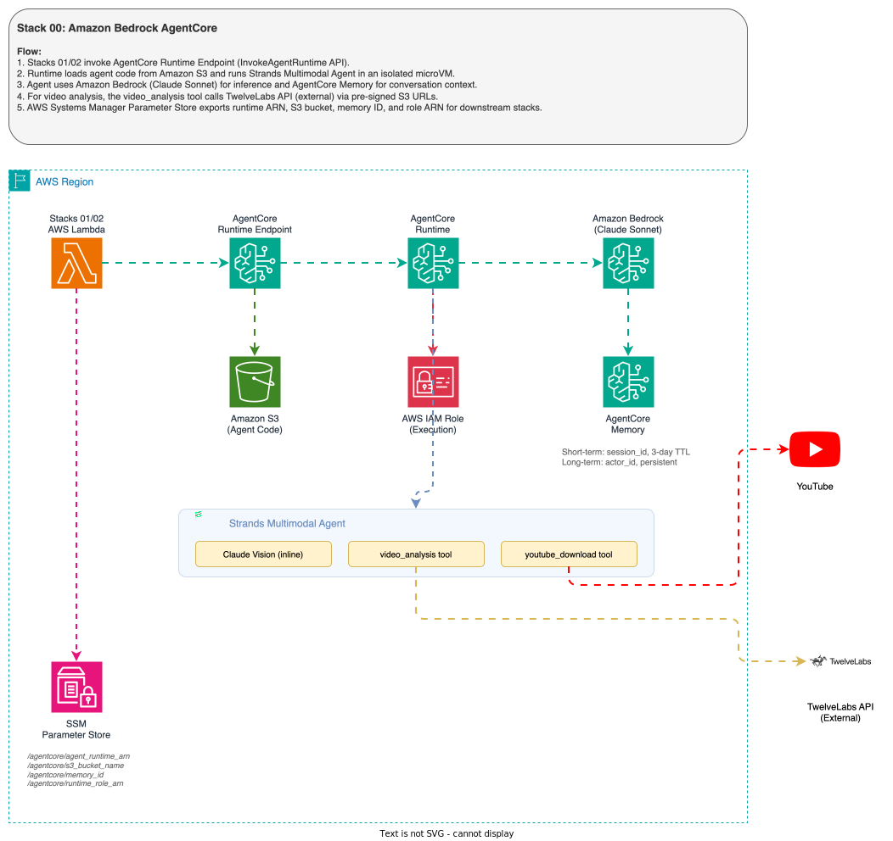

# 00 - Amazon Bedrock AgentCore Runtime + Multimodal Agent

Standalone [**Amazon Bedrock AgentCore Runtime**](https://aws.amazon.com/bedrock/agentcore/?trk=87c4c426-cddf-4799-a299-273337552ad8&sc_channel=el) with a [**Strands Agents**](https://github.com/strands-agents/sdk-python) multimodal agent and [**Amazon Bedrock AgentCore Memory**](https://docs.aws.amazon.com/bedrock-agentcore/latest/devguide/memory.html?trk=87c4c426-cddf-4799-a299-273337552ad8&sc_channel=el). This is the foundational stack — the WhatsApp integration stacks (01 and 02) depend on it.

The agent processes text, images, documents, audio transcripts, and videos. Since Amazon Bedrock AgentCore Memory only stores text, all multimedia is first understood by the agent and the text understanding is stored in memory.

## Architecture



## Key Files

| File | Purpose |
|------|---------|
| `agent_files/multimodal_agent.py` | Strands Agent — handles text, image, document, audio, video |
| `agent_files/video_analysis_tool.py` | Strands tool calling [TwelveLabs Pegasus](https://docs.twelvelabs.io/docs/concepts/models) via [TwelveLabs API](https://www.twelvelabs.io/) (direct) |
| `agent_files/requirements.txt` | Runtime dependencies (strands-agents, bedrock-agentcore) |
| `create_deployment_package.sh` | Builds ARM64-optimized ZIP for AgentCore Runtime |
| `agentcore/agentcore_deployment.py` | CDK construct for [CfnRuntime](https://docs.aws.amazon.com/bedrock-agentcore/latest/devguide/runtimes.html?trk=87c4c426-cddf-4799-a299-273337552ad8&sc_channel=el) |
| `agentcore/agentcore_memory.py` | CDK construct for [CfnMemory](https://docs.aws.amazon.com/bedrock-agentcore/latest/devguide/memory.html?trk=87c4c426-cddf-4799-a299-273337552ad8&sc_channel=el) (semantic + user preference strategies) |
| `agentcore/agentcore_role.py` | IAM role with Bedrock, CloudWatch, XRay permissions |

## Multimedia Processing

| Media Type | Formats | Limits | How It Works |
|------------|---------|--------|-------------|
| **Image** | JPEG, PNG, GIF, WebP | Max 5 MB, max 8000x8000 px | Claude vision via inline content blocks |
| **Document** | PDF, CSV, DOC, DOCX, XLS, XLSX, HTML, TXT, MD | Max ~1.5 MB, PDFs up to 600 pages | Claude reads via inline content blocks |
| **Video** | MP4, MOV, MKV, WebM, FLV, MPEG, 3GP | Max 2 GB / 1 hour, min ~4s, H.264/H.265 | `video_analysis` tool via [TwelveLabs Pegasus](https://docs.twelvelabs.io/docs/concepts/models) ([TwelveLabs API](https://www.twelvelabs.io/) direct) |
| **Audio** | OGG, MP3, AAC, M4A, WAV, AMR | Any WhatsApp format | [Amazon Transcribe](https://aws.amazon.com/transcribe/?trk=87c4c426-cddf-4799-a299-273337552ad8&sc_channel=el) → text prompt |

## Runtime Session Lifecycle

Each [Amazon Bedrock AgentCore Runtime session](https://docs.aws.amazon.com/bedrock-agentcore/latest/devguide/runtime-sessions.html?trk=87c4c426-cddf-4799-a299-273337552ad8&sc_channel=el) runs in an isolated microVM:

| Parameter | Value |
|-----------|-------|
| **Maximum session duration** | 8 hours |
| **Idle timeout** | 15 minutes of inactivity |
| **Isolation** | Dedicated microVM per session |

After code or IAM changes, wait 15 minutes for idle sessions to terminate, or use a new `session_id` to start a fresh container.

## SSM Parameters Exported

| Parameter | Value |
|-----------|-------|
| `/agentcore/agent_runtime_arn` | AgentCore Runtime ARN |
| `/agentcore/s3_bucket_name` | S3 bucket for media/code |
| `/agentcore/memory_id` | AgentCore Memory ID |
| `/agentcore/runtime_role_arn` | Runtime execution role ARN (used by Stack 01 to grant S3 read access) |

## Deploy

```bash
cd 00-agent-agentcore
python3 -m venv .venv && source .venv/bin/activate
uv pip install -r requirements.txt
bash create_deployment_package.sh   # builds ARM64 ZIP in agent_files/
cdk deploy
```

## How do I configure the AI models?

Both the LLM (Large Language Model) and the video analysis model are configurable via environment variables. To change a model, set the variable before running `cdk deploy` — no code changes required.

| Variable | Default | Description | How to change |
|----------|---------|-------------|---------------|
| `MODEL_ID` | `us.anthropic.claude-sonnet-4-20250514-v1:0` | [Anthropic Claude](https://docs.aws.amazon.com/bedrock/latest/userguide/models-supported.html?trk=87c4c426-cddf-4799-a299-273337552ad8&sc_channel=el) model for the agent | Set `MODEL_ID` env var before deploy. See [supported models](https://docs.aws.amazon.com/bedrock/latest/userguide/models-supported.html?trk=87c4c426-cddf-4799-a299-273337552ad8&sc_channel=el). |
| `TL_MODEL_NAME` | `pegasus1.2` | [TwelveLabs Pegasus](https://docs.twelvelabs.io/docs/concepts/models) model for video analysis | Set `TL_MODEL_NAME` env var before deploy. See [TwelveLabs models](https://docs.twelvelabs.io/docs/concepts/models). |

Example — deploy with a different Claude model:

```bash
export MODEL_ID="us.anthropic.claude-sonnet-4-6-20250514-v1:0"
cdk deploy
```

## How do I set up TwelveLabs for video analysis?

[TwelveLabs](https://www.twelvelabs.io/) provides the video understanding capabilities (scene detection, action recognition, speech-to-text, on-screen text extraction).

**Step 1**: Create a free account at [TwelveLabs Dashboard](https://dashboard.twelvelabs.io/).

**Step 2**: Generate an API key from the [API Keys page](https://dashboard.twelvelabs.io/api-key).

**Step 3**: After deploying the stack, update the API key in [AWS Secrets Manager](https://aws.amazon.com/secrets-manager/?trk=87c4c426-cddf-4799-a299-273337552ad8&sc_channel=el):

```bash
aws secretsmanager put-secret-value \
  --secret-id <TwelveLabsSecretArn from stack output> \
  --secret-string '{"TL_API_KEY":"your-actual-key"}'
```

The agent automatically creates a TwelveLabs index (`whatsapp-video-index`) on first use and uploads videos for analysis via pre-signed S3 URLs.

## Environment Variables (Runtime)

| Variable | Default | Description |
|----------|---------|-------------|
| `AWS_REGION` | `us-east-1` | AWS region for all API calls |
| `MODEL_ID` | `us.anthropic.claude-sonnet-4-20250514-v1:0` | [Claude model ID](https://docs.aws.amazon.com/bedrock/latest/userguide/models-supported.html?trk=87c4c426-cddf-4799-a299-273337552ad8&sc_channel=el) |
| `TL_MODEL_NAME` | `pegasus1.2` | [TwelveLabs model](https://docs.twelvelabs.io/docs/concepts/models) for video indexing |
| `TL_SECRET_ARN` | Set by stack | Secrets Manager ARN for TwelveLabs API key |
| `BEDROCK_AGENTCORE_MEMORY_ID` | Set by stack | AgentCore Memory resource ID |

## CDK Resources

- **S3 Bucket** — versioned, auto-delete on stack removal
- **[CfnMemory](https://docs.aws.amazon.com/bedrock-agentcore/latest/devguide/memory.html?trk=87c4c426-cddf-4799-a299-273337552ad8&sc_channel=el)** — semantic + user preference strategies, 3-day TTL
- **[CfnRuntime](https://docs.aws.amazon.com/bedrock-agentcore/latest/devguide/runtimes.html?trk=87c4c426-cddf-4799-a299-273337552ad8&sc_channel=el)** — Python 3.11, PUBLIC network mode, ARM64
- **CfnRuntimeEndpoint** — `WhatsAppAgentEndpoint`
- **IAM Role** — Bedrock, CloudWatch, XRay, S3 access, Marketplace subscriptions
- **[SSM Parameters](https://docs.aws.amazon.com/systems-manager/latest/userguide/systems-manager-parameter-store.html?trk=87c4c426-cddf-4799-a299-273337552ad8&sc_channel=el)** — 4 parameters for cross-stack sharing (runtime ARN, bucket, memory ID, role ARN)

---

## Contributing

Contributions are welcome! See [CONTRIBUTING](../CONTRIBUTING.md) for more information.

---

## Security

If you discover a potential security issue in this project, notify AWS/Amazon Security via the [vulnerability reporting page](http://aws.amazon.com/security/vulnerability-reporting/). Please do **not** create a public GitHub issue.

---

## License

This library is licensed under the MIT-0 License. See the [LICENSE](../LICENSE) file for details.
