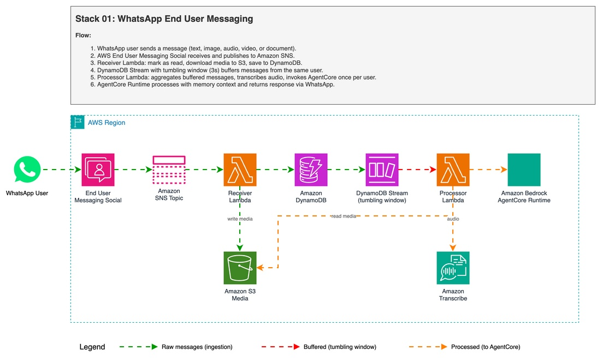

# WhatsApp Multimodal AI Agent with AWS End User Messaging Social and Amazon Bedrock AgentCore

Process text, images, video, audio, and documents from WhatsApp using [AWS End User Messaging Social](https://aws.amazon.com/end-user-messaging/?trk=87c4c426-cddf-4799-a299-273337552ad8&sc_channel=el) for direct WhatsApp integration, a single [AWS Lambda](https://aws.amazon.com/lambda/?trk=87c4c426-cddf-4799-a299-273337552ad8&sc_channel=el) function, and [Amazon Bedrock AgentCore Runtime](https://aws.amazon.com/bedrock/agentcore/?trk=87c4c426-cddf-4799-a299-273337552ad8&sc_channel=el) with [Amazon Bedrock AgentCore Memory](https://docs.aws.amazon.com/bedrock-agentcore/latest/devguide/memory.html?trk=87c4c426-cddf-4799-a299-273337552ad8&sc_channel=el) for persistent conversation context. This creates a serverless solution that eliminates the need for additional API layers.

> Your data will be securely stored in your AWS account and will not be shared or used for model training. It is not recommended to share private information because the security of data with WhatsApp is not guaranteed.

| Voice notes | Image |
|----------|------------|
||  |

| Video | Document |
|--------------|--------------|
|||

✅ **AWS Level**: Advanced - 300

**Prerequisites:**

- [AWS Account](https://aws.amazon.com/resources/create-account/?trk=87c4c426-cddf-4799-a299-273337552ad8&sc_channel=el)
- [Foundational knowledge of Python](https://catalog.us-east-1.prod.workshops.aws/workshops/3d705026-9edc-40e8-b353-bdabb116c89c/?trk=87c4c426-cddf-4799-a299-273337552ad8&sc_channel=el)
- [AWS CLI configured](https://docs.aws.amazon.com/cli/v1/userguide/cli-chap-configure.html?trk=87c4c426-cddf-4799-a299-273337552ad8&sc_channel=el) with appropriate permissions
- [Python 3.11](https://www.python.org/downloads/) or later
- [AWS Cloud Development Kit (CDK)](https://docs.aws.amazon.com/cdk/v2/guide/getting_started.html?trk=87c4c426-cddf-4799-a299-273337552ad8&sc_channel=el) v2 or later
- [Have or create a Meta Business Account](https://docs.aws.amazon.com/social-messaging/latest/userguide/getting-started-whatsapp.html#getting-started-embedded?trk=87c4c426-cddf-4799-a299-273337552ad8&sc_channel=el)
- Stack `00-agent-agentcore` deployed (provides SSM parameters)
- [TwelveLabs Pegasus](https://aws.amazon.com/marketplace/pp/prodview-mf4e5dbnkqvck?trk=87c4c426-cddf-4799-a299-273337552ad8&sc_channel=el) model enabled in [Amazon Bedrock](https://aws.amazon.com/bedrock/?trk=87c4c426-cddf-4799-a299-273337552ad8&sc_channel=el) console for video analysis

## How The App Works



### Infrastructure

The project uses [AWS Cloud Development Kit (AWS CDK)](https://aws.amazon.com/cdk/?trk=87c4c426-cddf-4799-a299-273337552ad8&sc_channel=el) to define and deploy the following resources:

- [AWS Lambda](https://docs.aws.amazon.com/lambda/latest/dg/welcome.html?trk=87c4c426-cddf-4799-a299-273337552ad8&sc_channel=el):
  - `webhook_receiver`: Receives WhatsApp messages, downloads media to S3, saves to DynamoDB, and triggers debounce buffer.
  - `message_processor`: Aggregates buffered messages, invokes the agent, and sends replies.

- [Amazon Simple Storage Service (Amazon S3)](https://aws.amazon.com/s3/?trk=87c4c426-cddf-4799-a299-273337552ad8&sc_channel=el):
  - Bucket for storing media files, organized by type: `images/`, `voice/`, `video/`, `documents/`.

- [Amazon DynamoDB](https://aws.amazon.com/dynamodb/?trk=87c4c426-cddf-4799-a299-273337552ad8&sc_channel=el):
  - Message buffer with [DynamoDB Streams](https://docs.aws.amazon.com/amazondynamodb/latest/developerguide/Streams.html?trk=87c4c426-cddf-4799-a299-273337552ad8&sc_channel=el) and tumbling window for message aggregation.
  - Partition key `from_phone` ensures messages from the same user land in the same shard.
  - TTL for automatic cleanup of processed messages.

- [Amazon Simple Notification Service (Amazon SNS)](https://aws.amazon.com/sns/?trk=87c4c426-cddf-4799-a299-273337552ad8&sc_channel=el):
  - Topic for receiving WhatsApp events from AWS End User Messaging Social.

- [Amazon Bedrock AgentCore](https://aws.amazon.com/bedrock/agentcore/?trk=87c4c426-cddf-4799-a299-273337552ad8&sc_channel=el):
  - Runtime invocation for processing all message types with multimodal Strands agent.
  - Memory for persistent conversation context (short-term + long-term).

- [Amazon Transcribe](https://aws.amazon.com/transcribe/?trk=87c4c426-cddf-4799-a299-273337552ad8&sc_channel=el):
  - Used for transcribing audio/voice messages before sending to the agent.

- [AWS End User Messaging Social](https://aws.amazon.com/end-user-messaging/?trk=87c4c426-cddf-4799-a299-273337552ad8&sc_channel=el):
  - Natively links WhatsApp Business Account (WABA) and AWS account.

### Data Flow

1. User sends a WhatsApp message.
2. Message is received by AWS End User Messaging Social and published to the Amazon SNS Topic.
3. `webhook_receiver` Lambda is triggered: marks as read, sends reaction, downloads media to S3, saves to DynamoDB (`PENDING`).
4. Debounce buffer: an atomic counter is incremented and an SQS message is sent with `DelaySeconds=3`.
5. After 3 seconds of inactivity, `message_processor` Lambda fires:
   - Checks if its counter matches the current value (skips if a newer message arrived).
   - Queries all `PENDING` messages for the phone number.
   - Aggregates text messages (joined with newlines) and selects the last media item.
   - Processes media based on type:
     - **Text**: Sent directly to Amazon Bedrock AgentCore Runtime.
     - **Audio**: Transcribed using [Amazon Transcribe](https://aws.amazon.com/transcribe/?trk=87c4c426-cddf-4799-a299-273337552ad8&sc_channel=el), then the transcript is sent as text to the agent.
     - **Image**: Downloaded from S3, base64-encoded, sent as inline content block to the agent (Claude vision).
     - **Video**: S3 URI sent to the agent which uses the `video_analysis` tool ([TwelveLabs Pegasus](https://aws.amazon.com/marketplace/pp/prodview-mf4e5dbnkqvck?trk=87c4c426-cddf-4799-a299-273337552ad8&sc_channel=el) via [Amazon Bedrock](https://aws.amazon.com/bedrock/?trk=87c4c426-cddf-4799-a299-273337552ad8&sc_channel=el)).
     - **Document**: Downloaded from S3, base64-encoded, sent as inline document block to the agent.
6. Amazon Bedrock AgentCore Runtime processes the aggregated message with [Amazon Bedrock AgentCore Memory](https://docs.aws.amazon.com/bedrock-agentcore/latest/devguide/memory.html?trk=87c4c426-cddf-4799-a299-273337552ad8&sc_channel=el) context.
7. Response is sent back to the user via WhatsApp.

### Message Buffering (Tumbling Window)

When users send multiple messages in quick succession (common in WhatsApp), the tumbling window accumulates them into a single agent invocation. This reduces token usage and AgentCore Runtime costs.

**How it works:**

1. Each incoming message is saved to DynamoDB with `from_phone` as partition key.
2. DynamoDB Streams captures the INSERT event.
3. The Lambda event source mapping uses a **tumbling window** (`tumbling_window` + `max_batching_window`) to accumulate records for N seconds before invoking the processor.
4. Since all messages from the same phone share the same partition key, they land in the same shard and are processed together.
5. The processor groups by sender, concatenates text messages with newlines, and invokes AgentCore once per sender.

```
User sends 3 messages in 2 seconds:
  "hola"           -> DDB INSERT (t=0s)
  "tengo una duda" -> DDB INSERT (t=1s)
  "sobre mi video" -> DDB INSERT (t=2s)

Tumbling window fires at t=3s:
  -> Processor receives all 3 records in one batch
  -> Aggregates: "hola\ntengo una duda\nsobre mi video"
  -> Single AgentCore invocation
```

The buffer duration is configurable in the CDK construct (default: 3 seconds).

> This buffering technique is based on [sample-whatsapp-end-user-messaging-connect-chat](https://github.com/aws-samples/sample-whatsapp-end-user-messaging-connect-chat), which demonstrates DynamoDB Streams with tumbling windows for WhatsApp message aggregation. That project reports reducing ~1,000 raw messages to ~250 aggregated messages (4:1 ratio), yielding approximately 75% cost savings on downstream processing. In our case, the savings apply to AgentCore Runtime invocations and LLM token usage.

### S3 Media Organization

```
s3://media-bucket/
├── images/       ← WhatsApp image attachments
├── voice/        ← Voice messages and audio
├── video/        ← Video files (read by AgentCore Runtime for analysis)
└── documents/    ← PDF, DOCX, and other documents
```

### For pricing details, see:

- [Amazon Bedrock Pricing](https://aws.amazon.com/bedrock/pricing/?trk=87c4c426-cddf-4799-a299-273337552ad8&sc_channel=el)
- [AWS Lambda Pricing](https://aws.amazon.com/lambda/pricing/?trk=87c4c426-cddf-4799-a299-273337552ad8&sc_channel=el)
- [Amazon Transcribe Pricing](https://aws.amazon.com/transcribe/pricing/?trk=87c4c426-cddf-4799-a299-273337552ad8&sc_channel=el)
- [Amazon S3 Pricing](https://aws.amazon.com/s3/pricing/?trk=87c4c426-cddf-4799-a299-273337552ad8&sc_channel=el)
- [Amazon DynamoDB Pricing](https://aws.amazon.com/dynamodb/pricing/?trk=87c4c426-cddf-4799-a299-273337552ad8&sc_channel=el)
- [AWS End User Messaging Pricing](https://aws.amazon.com/end-user-messaging/pricing/?trk=87c4c426-cddf-4799-a299-273337552ad8&sc_channel=el)
- [Amazon Simple Notification Service Pricing](https://aws.amazon.com/sns/pricing/?trk=87c4c426-cddf-4799-a299-273337552ad8&sc_channel=el)
- [WhatsApp pricing](https://developers.facebook.com/docs/whatsapp/pricing/)

### Key Files

- `app.py`: Entry point for the CDK application.
- `whatsapp_end_user_messaging/whatsapp_stack.py`: Main stack definition.
- `lambdas/code/whatsapp_handler/lambda_function.py`: Main handler — routes by message type, processes media, invokes agent.
- `lambdas/code/whatsapp_handler/whatsapp_service.py`: Parses SNS/WhatsApp webhook, message extraction, reply/reaction methods.
- `lambdas/code/whatsapp_handler/agentcore_service.py`: Invokes Amazon Bedrock AgentCore Runtime with actor/session IDs.
- `lambdas/project_lambdas.py`: CDK construct for Lambda + IAM permissions.
- `get_param.py`: Reads AgentCore ARN and role ARN from [AWS Systems Manager Parameter Store](https://docs.aws.amazon.com/systems-manager/latest/userguide/systems-manager-parameter-store.html?trk=87c4c426-cddf-4799-a299-273337552ad8&sc_channel=el) at CDK synthesis time.

## Usage Instructions

### Installation

✅ **Clone the repository**:
```
git clone https://github.com/aws-samples/whatsapp-ai-agent-sample-for-aws-agentcore
cd 01-whatsapp-end-user-messaging
```

✅ **Create and activate a virtual environment**:
```
python3 -m venv .venv
source .venv/bin/activate
```

✅ **Install dependencies**:
```
uv pip install -r requirements.txt
```

✅ **Synthesize the CloudFormation template**:
```
cdk synth
```

✅ **Deploy**:
```
cdk deploy
```

> Note the output values, especially the Amazon SNS Topic ARN, which will be used for configuring the WhatsApp integration.

## Configuration

### Step 0: Activate WhatsApp account

1. [Get Started with the New WhatsApp Business Platform](https://www.youtube.com/watch?v=CEt_KMMv3V8&list=PLX_K_BlBdZKi4GOFmJ9_67og7pMzm2vXH&index=2&t=17s&pp=gAQBiAQB)
2. [How To Generate a Permanent Access Token — WhatsApp API](https://www.youtube.com/watch?v=LmoiCMJJ6S4&list=PLX_K_BlBdZKi4GOFmJ9_67og7pMzm2vXH&index=1&t=158s&pp=gAQBiAQB)

### Step 1: AWS End User Messaging Social Set Up

Set up a WhatsApp Business account by following the [Getting started with AWS End User Messaging Social steps](https://docs.aws.amazon.com/social-messaging/latest/userguide/getting-started-whatsapp.html?trk=87c4c426-cddf-4799-a299-273337552ad8&sc_channel=el) and configure it to send messages to the [Amazon SNS Topic](https://console.aws.amazon.com/sns/home?trk=87c4c426-cddf-4799-a299-273337552ad8&sc_channel=el) created by this stack.

> You can also follow the more detailed steps in [Automate workflows with WhatsApp using AWS End User Messaging Social blog](https://aws.amazon.com/blogs/messaging-and-targeting/whatsapp-aws-end-user-messaging-social/?trk=87c4c426-cddf-4799-a299-273337552ad8&sc_channel=el).

### Step 2: Deploy Stack 00 (AgentCore) first

This stack depends on the Amazon Bedrock AgentCore Runtime deployed in `00-agent-agentcore`. Make sure it is deployed and the SSM parameters are available:

- `/agentcore/agent_runtime_arn`
- `/agentcore/runtime_role_arn`

### Step 3: Test

1. Send a WhatsApp message to the configured phone number.
2. Text messages are sent directly to the Amazon Bedrock AgentCore Runtime.
3. Audio messages are transcribed using Amazon Transcribe, then sent to the agent.
4. Images, videos, and documents are downloaded to Amazon S3 and processed by the agent.
5. The response is sent back to the user via WhatsApp.

## Clean up

If you finish testing and want to clean the application:

1. Delete the files from the Amazon S3 bucket created in the deployment.
2. Run this command in your terminal:

```
cdk destroy
```

## Some links for more information

- [Automate workflows with WhatsApp using AWS End User Messaging Social](https://aws.amazon.com/blogs/messaging-and-targeting/whatsapp-aws-end-user-messaging-social/?trk=87c4c426-cddf-4799-a299-273337552ad8&sc_channel=el)
- [Amazon Bedrock AgentCore documentation](https://docs.aws.amazon.com/bedrock-agentcore/latest/devguide/?trk=87c4c426-cddf-4799-a299-273337552ad8&sc_channel=el)
- [Amazon Bedrock AgentCore Runtime Sessions](https://docs.aws.amazon.com/bedrock-agentcore/latest/devguide/runtime-sessions.html?trk=87c4c426-cddf-4799-a299-273337552ad8&sc_channel=el)
- [Amazon Bedrock AgentCore Memory](https://docs.aws.amazon.com/bedrock-agentcore/latest/devguide/memory.html?trk=87c4c426-cddf-4799-a299-273337552ad8&sc_channel=el)
