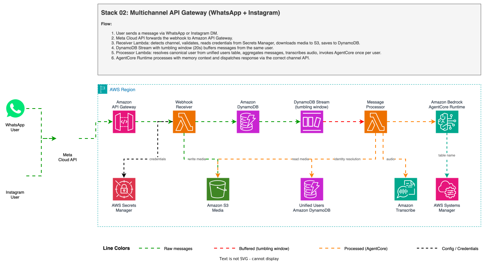
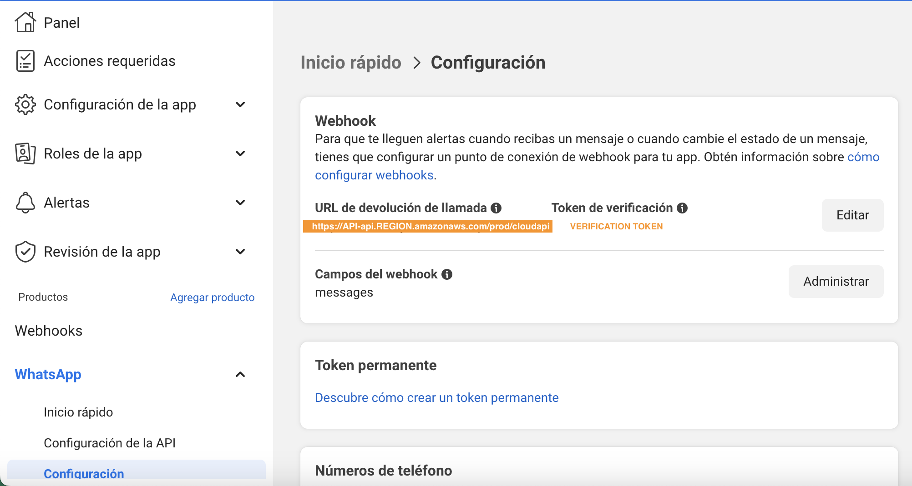

# Multichannel AI Agent: WhatsApp + Instagram via API Gateway

> **Last updated**: 2026-03-30

A dual-channel AI agent that processes text, images, video, audio, and documents from **WhatsApp** and **Instagram DMs** through a single [Amazon API Gateway](https://aws.amazon.com/api-gateway/?trk=87c4c426-cddf-4799-a299-273337552ad8&sc_channel=el) webhook. One deployment serves both platforms using [Amazon Bedrock AgentCore](https://aws.amazon.com/bedrock/agentcore/?trk=87c4c426-cddf-4799-a299-273337552ad8&sc_channel=el) with cross-channel memory.

The architecture uses a 2-Lambda pipeline with [DynamoDB Streams](https://docs.aws.amazon.com/amazondynamodb/latest/developerguide/Streams.html?trk=87c4c426-cddf-4799-a299-273337552ad8&sc_channel=el) tumbling window for message buffering (approximately 75% cost reduction), a unified users table for cross-channel identity, and automatic Instagram profile resolution via the [Meta Graph API](https://developers.facebook.com/docs/graph-api/).

> Your data will be securely stored in your AWS account and will not be shared or used for model training. It is not recommended to share private information because the security of data with WhatsApp or Instagram is not guaranteed.

| Voice notes | Image |
|----------|------------|
||  |

| Video | Instagram |
|--------------|--------------|
|||

✅ **AWS Level**: Advanced - 300

**Prerequisites:**

- [AWS Account](https://aws.amazon.com/resources/create-account/?trk=87c4c426-cddf-4799-a299-273337552ad8&sc_channel=el)
- [Foundational knowledge of Python](https://catalog.us-east-1.prod.workshops.aws/workshops/3d705026-9edc-40e8-b353-bdabb116c89c/?trk=87c4c426-cddf-4799-a299-273337552ad8&sc_channel=el)
- [AWS CLI configured](https://docs.aws.amazon.com/cli/v1/userguide/cli-chap-configure.html?trk=87c4c426-cddf-4799-a299-273337552ad8&sc_channel=el) with appropriate permissions
- [Python 3.12](https://www.python.org/downloads/) or later
- [AWS Cloud Development Kit (CDK)](https://docs.aws.amazon.com/cdk/v2/guide/getting_started.html?trk=87c4c426-cddf-4799-a299-273337552ad8&sc_channel=el) v2 or later
- [Meta Developer account](https://developers.facebook.com/) with WhatsApp Business API access
- For Instagram: An [Instagram Professional account](https://help.instagram.com/502981923235522) (Business or Creator) linked to [Meta Accounts Center](https://accountscenter.meta.com/) — see [How do I configure Instagram?](#how-do-i-configure-instagram) below
- Stack `00-agent-agentcore` deployed (provides SSM parameters)
- [TwelveLabs](https://www.twelvelabs.io/) API key for video analysis (free account at [twelvelabs.io](https://www.twelvelabs.io/))

## How does this application work?



### What infrastructure is deployed?

The project uses [AWS Cloud Development Kit (AWS CDK)](https://aws.amazon.com/cdk/?trk=87c4c426-cddf-4799-a299-273337552ad8&sc_channel=el) to define and deploy the following resources:

- [AWS Lambda](https://docs.aws.amazon.com/lambda/latest/dg/welcome.html?trk=87c4c426-cddf-4799-a299-273337552ad8&sc_channel=el):
  - `webhook_receiver`: Detects channel (`whatsapp_business_account` or `instagram`), validates webhook, downloads media to S3, normalizes to a common DynamoDB item format.
  - `message_processor`: Aggregates buffered messages, transcribes audio, invokes AgentCore, dispatches reply via WhatsApp or Instagram [Meta Graph API](https://developers.facebook.com/docs/graph-api/).

- [Amazon Simple Storage Service (Amazon S3)](https://aws.amazon.com/s3/?trk=87c4c426-cddf-4799-a299-273337552ad8&sc_channel=el):
  - Bucket for storing media files and transcription outputs.

- [Amazon DynamoDB](https://aws.amazon.com/dynamodb/?trk=87c4c426-cddf-4799-a299-273337552ad8&sc_channel=el):
  - **Messages table**: Buffer with [DynamoDB Streams](https://docs.aws.amazon.com/amazondynamodb/latest/developerguide/Streams.html?trk=87c4c426-cddf-4799-a299-273337552ad8&sc_channel=el) and tumbling window for message aggregation. Partition key `from_phone` ensures messages from the same user land in the same shard. TTL for automatic cleanup.
  - **Unified users table**: Cross-channel identity resolution. Maps WhatsApp phone numbers and Instagram IDs to a single canonical `user_id` used as `actor_id` in AgentCore Memory. GSIs on `wa_phone` and `ig_id` for lookups.

- [Amazon API Gateway](https://aws.amazon.com/api-gateway/?trk=87c4c426-cddf-4799-a299-273337552ad8&sc_channel=el):
  - REST API with `/webhook` endpoint (POST for messages, GET for verification).

- [AWS Secrets Manager](https://aws.amazon.com/secrets-manager/?trk=87c4c426-cddf-4799-a299-273337552ad8&sc_channel=el):
  - **WhatsApp secret**: `WHATS_VERIFICATION_TOKEN` (webhook verification token), `WHATS_TOKEN` ([Meta Graph API](https://developers.facebook.com/docs/graph-api/) access token), and `DISPLAY_PHONE_NUMBER` (business phone number for message filtering).
  - **Instagram secret**: `IG_TOKEN` (Instagram access token), `IG_ACCOUNT_ID` (Instagram Business Account ID), and `IG_VERIFICATION_TOKEN` (webhook verification token for Instagram).

- [Amazon Bedrock AgentCore](https://aws.amazon.com/bedrock/agentcore/?trk=87c4c426-cddf-4799-a299-273337552ad8&sc_channel=el):
  - Runtime invocation for processing all message types with multimodal Strands agent.
  - Memory for persistent conversation context (short-term + long-term).

- [Amazon Transcribe](https://aws.amazon.com/transcribe/?trk=87c4c426-cddf-4799-a299-273337552ad8&sc_channel=el):
  - Used for transcribing audio/voice messages (synchronous polling in the processor Lambda).

### What is the data flow?

1. User sends a message via **WhatsApp** or **Instagram DM**.
2. [Meta Cloud API](https://developers.facebook.com/docs/graph-api/) forwards the message to the shared [Amazon API Gateway](https://aws.amazon.com/api-gateway/?trk=87c4c426-cddf-4799-a299-273337552ad8&sc_channel=el) webhook endpoint (`/webhook`).
3. `webhook_receiver` Lambda detects the channel from `body.object` (`whatsapp_business_account` or `instagram`), normalizes the message, downloads media to S3, and saves to DynamoDB with a `channel` field.
   - **WhatsApp** messages use `from_phone` = phone number as partition key.
   - **Instagram** messages use `from_phone` = `ig-{sender_id}` as partition key (prefixed to avoid collisions).
4. DynamoDB Streams captures the INSERT event. The tumbling window (20 seconds) buffers records before invoking `message_processor`.
5. `message_processor` aggregates all buffered messages per sender:
   - **Text**: Messages joined with newlines into a single prompt.
   - **Image/Document**: Downloaded from S3, base64-encoded, sent as inline content block to the agent.
   - **Video**: S3 URI sent to the agent which uses the `video_analysis` tool ([TwelveLabs Pegasus](https://docs.twelvelabs.io/docs/concepts/models) via [TwelveLabs API](https://www.twelvelabs.io/)).
   - **Audio**: Transcribed synchronously using [Amazon Transcribe](https://aws.amazon.com/transcribe/?trk=87c4c426-cddf-4799-a299-273337552ad8&sc_channel=el), then sent as text to the agent.
6. [Amazon Bedrock AgentCore Runtime](https://aws.amazon.com/bedrock/agentcore/?trk=87c4c426-cddf-4799-a299-273337552ad8&sc_channel=el) processes the aggregated message with memory context.
7. Response is dispatched back to the user via the correct channel:
   - **WhatsApp**: `POST https://graph.facebook.com/{phone_id}/messages` with `messaging_product: whatsapp`.
   - **Instagram**: `POST https://graph.instagram.com/v24.0/{ig_account_id}/messages` with `recipient.id`.

### How does message buffering work?

The architecture uses a [DynamoDB Streams tumbling window](https://docs.aws.amazon.com/amazondynamodb/latest/developerguide/Streams.Lambda.html?trk=87c4c426-cddf-4799-a299-273337552ad8&sc_channel=el) (default: 20 seconds) to batch rapid-fire WhatsApp messages into a single agent invocation. When users send multiple messages in quick succession (common in WhatsApp), this reduces token usage and AgentCore Runtime costs.

**How it works:**

1. Each incoming message is saved to DynamoDB with `from_phone` as partition key.
2. DynamoDB Streams captures the INSERT event.
3. The Lambda event source mapping uses a **tumbling window** (`tumbling_window` + `max_batching_window`) to accumulate records for N seconds before invoking the processor.
4. Since all messages from the same phone share the same partition key, they land in the same shard and are processed together.
5. The processor groups by sender, concatenates text messages with newlines, and invokes AgentCore once per sender.

```
User sends 3 messages in 2 seconds:
  "hola"           -> DDB INSERT (t=0s)
  "tengo una duda" -> DDB INSERT (t=1s)
  "sobre mi video" -> DDB INSERT (t=2s)

Tumbling window fires at t=20s:
  -> Processor receives all 3 records in one batch
  -> Aggregates: "hola\ntengo una duda\nsobre mi video"
  -> Single AgentCore invocation
```

The buffer duration is configurable in the CDK construct (default: 20 seconds).

> This buffering technique is based on [sample-whatsapp-end-user-messaging-connect-chat](https://github.com/aws-samples/sample-whatsapp-end-user-messaging-connect-chat), which demonstrates DynamoDB Streams with tumbling windows for WhatsApp message aggregation. That project reports reducing ~1,000 raw messages to ~250 aggregated messages (4:1 ratio), yielding approximately 75% cost savings on downstream processing. In our case, the savings apply to AgentCore Runtime invocations and LLM token usage.

#### How does error handling and retry work?

The `message_processor` Lambda retries [AgentCore Runtime](https://docs.aws.amazon.com/bedrock-agentcore/latest/APIReference/API_InvokeAgentRuntime.html) invocations with exponential backoff (3 attempts, base delay 2 seconds) on transient errors:

| Error | HTTP | Cause | Reference |
|-------|------|-------|-----------|
| `InternalServerException` | 500 | Temporary runtime error | [AWS recommends exponential backoff](https://docs.aws.amazon.com/bedrock-agentcore/latest/APIReference/API_InvokeAgentRuntime.html) |
| `RuntimeClientError` | 424 | MicroVM unavailable (cold start after [session resume](https://docs.aws.amazon.com/bedrock-agentcore/latest/devguide/runtime-sessions.html)) | [Runtime Sessions docs](https://docs.aws.amazon.com/bedrock-agentcore/latest/devguide/runtime-sessions.html) |
| `ThrottlingException` | 429 | Rate limit exceeded | [API reference](https://docs.aws.amazon.com/bedrock-agentcore/latest/APIReference/API_InvokeAgentRuntime.html) |

[Strands Agents](https://strandsagents.com/) does not support concurrent calls to the same Agent instance ([ConcurrencyException](https://github.com/strands-agents/sdk-python/issues/1702)). If a second message arrives while the agent is processing a long request (e.g., video analysis), the retry mechanism waits and retries after the first request completes.

#### How does agent processing work?

1. `message_processor` invokes [Amazon Bedrock AgentCore Runtime](https://aws.amazon.com/bedrock/agentcore/?trk=87c4c426-cddf-4799-a299-273337552ad8&sc_channel=el) with the aggregated message payload.
2. [Amazon Bedrock AgentCore Memory](https://docs.aws.amazon.com/bedrock-agentcore/latest/devguide/memory.html?trk=87c4c426-cddf-4799-a299-273337552ad8&sc_channel=el) provides conversation context (short-term turns + long-term facts).
3. The response is sent back to the user via [Meta Graph API](https://developers.facebook.com/docs/graph-api/).

### What are the pricing details?

- [Amazon Bedrock Pricing](https://aws.amazon.com/bedrock/pricing/?trk=87c4c426-cddf-4799-a299-273337552ad8&sc_channel=el)
- [AWS Lambda Pricing](https://aws.amazon.com/lambda/pricing/?trk=87c4c426-cddf-4799-a299-273337552ad8&sc_channel=el)
- [Amazon Transcribe Pricing](https://aws.amazon.com/transcribe/pricing/?trk=87c4c426-cddf-4799-a299-273337552ad8&sc_channel=el)
- [Amazon S3 Pricing](https://aws.amazon.com/s3/pricing/?trk=87c4c426-cddf-4799-a299-273337552ad8&sc_channel=el)
- [Amazon DynamoDB Pricing](https://aws.amazon.com/dynamodb/pricing/?trk=87c4c426-cddf-4799-a299-273337552ad8&sc_channel=el)
- [Amazon API Gateway Pricing](https://aws.amazon.com/api-gateway/pricing/?trk=87c4c426-cddf-4799-a299-273337552ad8&sc_channel=el)
- [WhatsApp pricing](https://developers.facebook.com/docs/whatsapp/pricing/)

### What are the key files?

- `app.py`: Entry point for the CDK application.
- `lambdas/project_lambdas.py`: CDK construct defining both Lambdas, DynamoDB table, and permissions.
- `lambdas/code/webhook_receiver/lambda_function.py`: Webhook handler (POST: download media, store message in DynamoDB; GET: verify token).
- `lambdas/code/message_processor/lambda_function.py`: Stream consumer -- aggregates buffered messages, transcribes audio via [Amazon Transcribe](https://docs.aws.amazon.com/transcribe/latest/dg/what-is.html?trk=87c4c426-cddf-4799-a299-273337552ad8&sc_channel=el), invokes [Amazon Bedrock AgentCore Runtime](https://aws.amazon.com/bedrock/agentcore/?trk=87c4c426-cddf-4799-a299-273337552ad8&sc_channel=el), sends reply via [Meta Graph API](https://developers.facebook.com/docs/graph-api/).
- `layers/common/python/utils.py`: Webhook validation, response builders, phone normalization.
- `layers/common/python/media_utils.py`: Media download (Graph API), Amazon S3 upload, base64 encoding.
- `apis/webhooks.py`: Amazon API Gateway REST API construct.
- `get_param.py`: Reads AgentCore ARN from [AWS Systems Manager Parameter Store](https://docs.aws.amazon.com/systems-manager/latest/userguide/systems-manager-parameter-store.html?trk=87c4c426-cddf-4799-a299-273337552ad8&sc_channel=el) at synthesis time.

## How do I deploy this?

### Installation

✅ **Clone the repository**:
```bash
git clone https://github.com/aws-samples/whatsapp-ai-agent-sample-for-aws-agentcore
cd 02-multichannel-api-gateway
```

✅ **Create and activate a virtual environment**:
```bash
python3 -m venv .venv
source .venv/bin/activate
```

✅ **Install dependencies**:
```bash
uv pip install -r requirements.txt
```

✅ **Install layer dependencies**:
```bash
cd layers/common && pip install requests -t python/
```

✅ **Synthesize the CloudFormation template**:
```bash
cdk synth
```

✅ **Deploy**:
```bash
cdk deploy
```

> Note the output values, especially the Amazon API Gateway URL, which will be used for configuring the WhatsApp webhook.

## How do I configure WhatsApp?

### Step 0: Activate WhatsApp account Facebook Developers

1. [Get Started with the New WhatsApp Business Platform](https://www.youtube.com/watch?v=CEt_KMMv3V8&list=PLX_K_BlBdZKi4GOFmJ9_67og7pMzm2vXH&index=2&t=17s&pp=gAQBiAQB)
2. [How To Generate a Permanent Access Token — WhatsApp API](https://www.youtube.com/watch?v=LmoiCMJJ6S4&list=PLX_K_BlBdZKi4GOFmJ9_67og7pMzm2vXH&index=1&t=158s&pp=gAQBiAQB)

### Step 1: Deploy Stack 00 (AgentCore) first

This stack depends on the Amazon Bedrock AgentCore Runtime deployed in `00-agent-agentcore`. Make sure it is deployed and the SSM parameter is available:

- `/agentcore/agent_runtime_arn`

### Step 2: Set WhatsApp credentials

Edit WhatsApp configuration values in [AWS Secrets Manager](https://aws.amazon.com/secrets-manager/?trk=87c4c426-cddf-4799-a299-273337552ad8&sc_channel=el) [console](https://console.aws.amazon.com/secretsmanager/?trk=87c4c426-cddf-4799-a299-273337552ad8&sc_channel=el):

| Secret Key | Description | Where to find it |
|---|---|---|
| `WHATS_VERIFICATION_TOKEN` | Webhook verification token. You choose any value — must match the "Verify token" field in Meta webhook configuration (Step 3). | You define it |
| `WHATS_TOKEN` | Permanent Meta Graph API access token for sending messages. | [Meta Developer Console](https://developers.facebook.com/) → Your App → WhatsApp → API Setup → "Generate permanent token" |
| `DISPLAY_PHONE_NUMBER` | WhatsApp Business phone number (with country code, no `+`). Only messages to this number are processed. | [Meta Developer Console](https://developers.facebook.com/) → Your App → WhatsApp → API Setup → "Phone number" (e.g., `1234567890`) |

```bash
aws secretsmanager put-secret-value \
  --secret-id <SecretArn from stack output> \
  --secret-string '{"WHATS_VERIFICATION_TOKEN":"your-verify-token","WHATS_TOKEN":"EAAxxxxxxx","DISPLAY_PHONE_NUMBER":"your-phone-number"}'
```


### Step 3: Webhook Configuration

1. Go to [Amazon API Gateway Console](https://console.aws.amazon.com/apigateway?trk=87c4c426-cddf-4799-a299-273337552ad8&sc_channel=el).
2. Find the API created by the stack.
3. Go to **Stages** -> **prod** -> **/webhook** -> **GET**, and copy the **Invoke URL**.
4. Configure Webhook in the Meta Developer application:
   - Set **Callback URL** to the Invoke URL.
   - Set **Verify token** to the same value as `WHATS_VERIFICATION_TOKEN`.



### Step 4: Test WhatsApp

1. Send a WhatsApp message to the configured phone number.
2. Text messages are processed directly by the Amazon Bedrock AgentCore Runtime.
3. Audio messages are transcribed using Amazon Transcribe, then sent to the agent.
4. Images, videos, and documents are downloaded to Amazon S3 and processed by the agent.
5. The response is sent back to the user via WhatsApp.

## How do I configure Instagram?

Instagram Direct Messages use the same webhook endpoint and Lambda pipeline as WhatsApp. The receiver Lambda detects the channel automatically from the webhook payload and routes messages through the same buffering and processing pipeline.

### Step 0: Set up your Instagram Professional account

Your Instagram account must be a **Professional account** (Business or Creator) and must be linked to [Meta Accounts Center](https://accountscenter.meta.com/). This is required so that the Meta Developer Platform can access your Instagram account for API operations.

1. **Convert to a Professional account** (if not already):
   - Open Instagram -> Settings -> Account type and tools -> Switch to professional account.
   - Choose **Business** or **Creator**.
   - Reference: [Instagram Help: Switch to a Professional Account](https://help.instagram.com/502981923235522).

2. **Link your Instagram account to Meta Accounts Center**:
   - Go to [Meta Accounts Center](https://accountscenter.meta.com/) (or Instagram -> Settings -> Accounts Center).
   - Click **Add accounts** and add your Instagram Professional account.
   - Your Instagram account must be in the **same Accounts Center** as the Facebook account or Meta account associated with your [Meta Developer](https://developers.facebook.com/) account. This is how Meta verifies you own the Instagram account when generating API tokens.
   - Reference: [Meta Help: Add accounts to Accounts Center](https://www.facebook.com/help/instagram/176235449218188).

3. **Verify the link**:
   - In [Meta Accounts Center](https://accountscenter.meta.com/), you should see both your Facebook/Meta account and your Instagram Professional account listed under "Accounts."

### Step 1: Create or configure your Meta App for Instagram

1. Go to [Meta Developer Portal](https://developers.facebook.com/apps/).
2. Create a new app or use your existing WhatsApp app.
3. In the app dashboard, click **Add Product** and add **Instagram**.
4. Select **API setup with Instagram login**.
5. Under **Permissions**, make sure the following are enabled:
   - `instagram_business_basic` — Required for basic account access.
   - `instagram_business_manage_messages` — Required for sending and receiving DMs.
   - Reference: [Instagram Platform: Messaging API](https://developers.facebook.com/docs/instagram-platform/instagram-api-with-instagram-login/messaging-api).

> **Testing without App Review**: With **Standard Access** (default for all apps), you can test with your own Instagram accounts that have been added to your app. App Review is only required for Advanced Access (serving third-party accounts). Reference: [Instagram API Overview](https://developers.facebook.com/docs/instagram-platform/instagram-api-with-instagram-login/overview).

### Step 2: Generate an Instagram access token

1. In the [Meta Developer Portal](https://developers.facebook.com/apps/), go to your app.
2. Navigate to **Instagram > API setup with Instagram business login**.
3. Under **Generate access tokens**, find your Instagram account and click **Generate token**.
4. Log in with your Instagram account when prompted and authorize the permissions.
5. Copy the generated token.

> This token is **long-lived (60 days)**. Short-lived tokens from the Business Login flow are valid for 1 hour. Reference: [Instagram API: Get Started](https://developers.facebook.com/docs/instagram-platform/instagram-api-with-instagram-login/get-started).

### Step 3: Get your Instagram Account ID

Use the token from Step 2 to query the [Instagram Graph API](https://developers.facebook.com/docs/instagram-platform/instagram-api-with-instagram-login/get-started):

```bash
curl -s "https://graph.instagram.com/v24.0/me?fields=user_id,username&access_token=YOUR_IG_TOKEN"
```

The response contains your `user_id` — this is the `IG_ACCOUNT_ID` you need.

### Step 4: Set Instagram credentials

Update the Instagram secret in [AWS Secrets Manager](https://aws.amazon.com/secrets-manager/?trk=87c4c426-cddf-4799-a299-273337552ad8&sc_channel=el):

| Secret Key | Description | Where to find it |
|---|---|---|
| `IG_TOKEN` | Instagram API access token for sending messages. | [Meta Developer Console](https://developers.facebook.com/) -> Your App -> Instagram -> API setup with Instagram business login -> Generate token |
| `IG_ACCOUNT_ID` | Your Instagram Professional Account ID. Used to filter out echo messages (messages from your own account). | From the `/me` API call in Step 3, or from the `recipient.id` field in any incoming Instagram webhook payload. |
| `IG_VERIFICATION_TOKEN` | Webhook verification token for Instagram. You choose any value — must match the "Verify token" field in Meta webhook configuration (Step 5). | You define it |

```bash
aws secretsmanager put-secret-value \
  --secret-id <IGSecretArn from stack output> \
  --secret-string '{"IG_TOKEN":"IGQWRPza...","IG_ACCOUNT_ID":"17841400000000","IG_VERIFICATION_TOKEN":"your-ig-verify-token"}'
```

### Step 5: Configure Instagram Webhook

1. In the [Meta Developer Portal](https://developers.facebook.com/apps/), go to your app.
2. Navigate to **Instagram > Webhooks**.
3. Click **Configure** (or **Edit subscription**).
4. Set:
   - **Callback URL**: The same webhook URL used for WhatsApp (from the stack output `WebhookUrl`).
   - **Verify token**: The same value as `IG_VERIFICATION_TOKEN` in your secret.
5. Subscribe to the `messages` field (and optionally `messaging_seen`, `messaging_reactions`).
6. Click **Verify and save**.

> Both WhatsApp and Instagram can share the **same webhook URL**. The receiver Lambda distinguishes them by the `object` field in the payload (`whatsapp_business_account` vs `instagram`). Webhook verification also works for both — the Lambda tries the WhatsApp verification token first, then falls back to the Instagram verification token.

### Step 6: Test Instagram

1. Send a Direct Message to your Instagram Professional account from any Instagram account.
2. The message arrives at the shared webhook, is detected as `instagram`, and saved to DynamoDB with `from_phone = ig-{sender_id}`.
3. The tumbling window batches it (20 seconds), the processor invokes AgentCore, and the reply is sent back via the [Instagram Messaging API](https://developers.facebook.com/docs/instagram-platform/instagram-api-with-instagram-login/messaging-api).
4. The agent uses a canonical `user_id` as `actor_id` for memory. If the user has linked their WhatsApp and Instagram accounts, both channels share the same long-term memory.

## How does cross-channel identity work?

A **unified users table** maps WhatsApp phone numbers and Instagram IDs to a single canonical `user_id`. This `user_id` is used as `actor_id` in [Amazon Bedrock AgentCore Memory](https://docs.aws.amazon.com/bedrock-agentcore/latest/devguide/memory.html?trk=87c4c426-cddf-4799-a299-273337552ad8&sc_channel=el), so the same person shares long-term memory across channels.

### How Instagram usernames are resolved

Instagram webhooks only send a numeric `sender.id` (Instagram Scoped ID) — not the username. The `webhook_receiver` Lambda calls the [Instagram Graph API](https://developers.facebook.com/docs/instagram-platform/instagram-api-with-instagram-login/get-started) to resolve the profile:

```
GET https://graph.instagram.com/v24.0/{sender_id}?fields=name,username&access_token={IG_TOKEN}
```

This returns the user's `name` (display name) and `username` (the `@handle`). Both are stored in the DynamoDB message item (`contact_name` and `ig_username`) and in the unified users table. The profile is cached in-memory during each Lambda invocation to avoid repeated API calls for the same sender.

### How users get linked

On the first interaction, the agent asks the user if they also write from another channel (WhatsApp or Instagram). If the user provides their phone number or Instagram username, the agent calls a `link_account` tool that saves the identifier in the unified users table. This is a one-time action — the agent stores in memory that linking was completed and does not ask again.

When the user later writes from the linked channel, the processor resolves the identity in two steps:
1. **Fast path**: Query by `ig_id` GSI (or `wa_phone` GSI) — instant match if the numeric ID is already stored.
2. **Fallback**: If not found by ID (e.g., user linked by username from WhatsApp, but the numeric `ig_id` is only known when Instagram sends a webhook), scan by `ig_username` — matches the linked record and backfills the `ig_id` for instant future lookups.

### What the agent prompt includes

Each message sent to the agent includes context tags:

| Tag | Example | Purpose |
|-----|---------|---------|
| `[Channel: instagram]` | `[Channel: whatsapp]` | Tells the agent which platform the user is writing from |
| `[UserID: user-a1b2c3d4e5]` | | The canonical user ID for cross-channel linking |
| `[User: Maria]` | | Display name from WhatsApp contact or Instagram profile |

The agent uses these tags to personalize responses and manage account linking. The `[UserID:]` tag is only present when Stack 02 is deployed (multichannel). When using Stack 01 (WhatsApp only via SNS), these tags are absent and the agent works without cross-channel features.

### Agent system prompt highlights

- Always responds in the same language the user writes
- Greets new users by name and asks about their preferred name
- Asks about cross-channel linking only once (only when `[UserID:]` tag is present)
- Stores user preferences, facts, and media descriptions in long-term memory
- Supports video analysis via the `video_analysis` tool and account linking via the `link_account` tool

## How do I clean up resources?

If you finish testing and want to clean the application:

1. Delete the files from the Amazon S3 bucket created in the deployment.
2. Run this command in your terminal:

```bash
cdk destroy
```

## Frequently asked questions

**Can I use WhatsApp and Instagram with the same webhook URL?**
Yes. Both platforms send webhooks to the same `/webhook` endpoint. The receiver Lambda detects the channel from `body.object` (`whatsapp_business_account` vs `instagram`) and processes each accordingly.

**Do I need App Review from Meta to test Instagram?**
No. With Standard Access (default), you can test with Instagram accounts you own and have added to your app. App Review is only required for Advanced Access (serving third-party accounts). Reference: [Instagram API Overview](https://developers.facebook.com/docs/instagram-platform/instagram-api-with-instagram-login/overview).

**How does the agent know which language to respond in?**
The system prompt instructs the agent to always respond in the same language the user writes. This works automatically for any language.

**Why doesn't the agent remember images or videos I sent?**
AgentCore Memory retrieves facts using **semantic similarity** to your current message. If you ask a generic question like "what did I send you?", relevant facts may not be retrieved because they score below the relevance threshold. The agent is configured with `top_k: 20` and `relevance_score: 0.3` to maximize context. Also, long-term memory extraction is asynchronous — wait 2-3 minutes after sharing media before testing recall. The agent's prompt includes explicit "Fact:" lines to improve extraction of structured data like video IDs and image descriptions.

**How long does the Instagram token last?**
Tokens generated from the App Dashboard are long-lived (60 days). Tokens from the Business Login flow are short-lived (1 hour). Reference: [Instagram API: Get Started](https://developers.facebook.com/docs/instagram-platform/instagram-api-with-instagram-login/get-started).

**How can I add more channels like Telegram, Facebook Messenger, or a web chat?**
The AgentCore Runtime and Memory layer is channel-agnostic. To add a new channel, create a new receiver that normalizes incoming messages into the same DynamoDB item format (with `channel`, `from_phone`, `text`, `media_ref` fields). The processor Lambda and AgentCore invocation work without changes. For the reply, add a new dispatch branch in `_send_reply()`. For cross-channel identity, add a new GSI to the unified users table (e.g., `tg-id-index` for Telegram, `fb-id-index` for Messenger) and extend the `link_account` tool. For example, a [Telegram Bot API](https://core.telegram.org/bots/api) integration would use a webhook receiver that parses Telegram's `Update` object, stores messages with `from_phone = tg-{chat_id}`, and replies via `sendMessage`. See the [channel table in the main README](../README.md#what-channels-can-connect-to-this-agent) for `actor_id` strategies per platform.

**What if I only want WhatsApp, not Instagram?**
Deploy the stack and only configure the WhatsApp secret. Instagram messages will be ignored if no Instagram secret is configured. Alternatively, use Stack 01 (`01-whatsapp-end-user-messaging`) for a WhatsApp-only integration via AWS End User Messaging Social.

## Where can I learn more?

- [Amazon Bedrock AgentCore documentation](https://docs.aws.amazon.com/bedrock-agentcore/latest/devguide/?trk=87c4c426-cddf-4799-a299-273337552ad8&sc_channel=el)
- [Amazon Bedrock AgentCore Runtime Sessions](https://docs.aws.amazon.com/bedrock-agentcore/latest/devguide/runtime-sessions.html?trk=87c4c426-cddf-4799-a299-273337552ad8&sc_channel=el)
- [Amazon Bedrock AgentCore Memory](https://docs.aws.amazon.com/bedrock-agentcore/latest/devguide/memory.html?trk=87c4c426-cddf-4799-a299-273337552ad8&sc_channel=el)
- [Meta WhatsApp Cloud API documentation](https://developers.facebook.com/docs/whatsapp/cloud-api)
- [Instagram Platform: Messaging API](https://developers.facebook.com/docs/instagram-platform/instagram-api-with-instagram-login/messaging-api)
- [Instagram API with Instagram Login: Get Started](https://developers.facebook.com/docs/instagram-platform/instagram-api-with-instagram-login/get-started)
- [Instagram API with Instagram Login: Overview](https://developers.facebook.com/docs/instagram-platform/instagram-api-with-instagram-login/overview)
- [Meta Accounts Center](https://accountscenter.meta.com/)
- [DynamoDB Streams and AWS Lambda triggers](https://docs.aws.amazon.com/amazondynamodb/latest/developerguide/Streams.Lambda.html?trk=87c4c426-cddf-4799-a299-273337552ad8&sc_channel=el)
- [Meta Graph API reference](https://developers.facebook.com/docs/graph-api/)

---

## Contributing

Contributions are welcome! See [CONTRIBUTING](../CONTRIBUTING.md) for more information.

---

## Security

If you discover a potential security issue in this project, notify AWS/Amazon Security via the [vulnerability reporting page](http://aws.amazon.com/security/vulnerability-reporting/). Please do **not** create a public GitHub issue.

---

## License

This library is licensed under the MIT-0 License. See the [LICENSE](../LICENSE) file for details.
