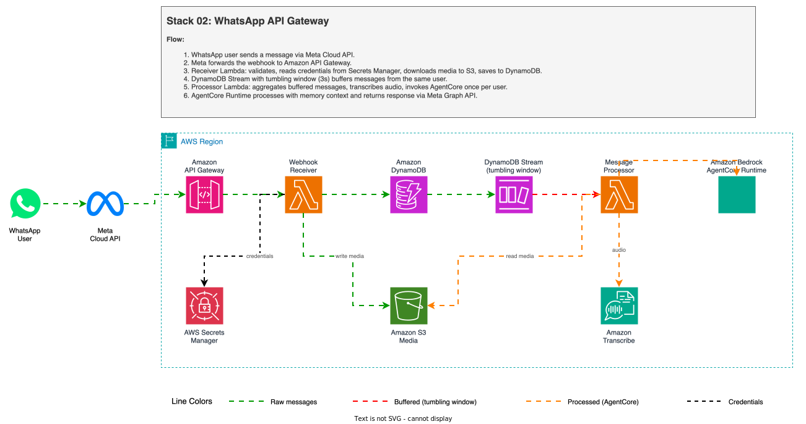
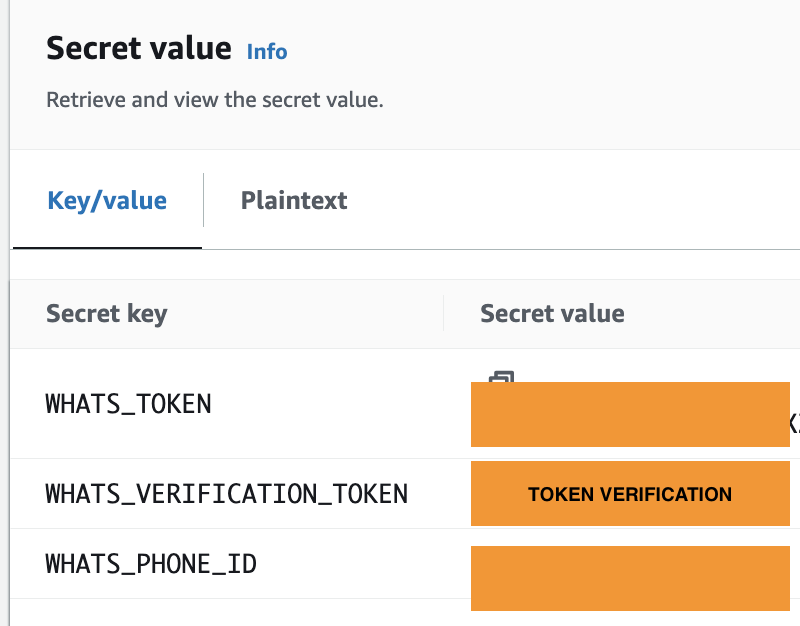

# WhatsApp Multimodal AI Agent with Meta Cloud API, Amazon API Gateway and Amazon Bedrock AgentCore

Process text, images, video, audio, and documents from WhatsApp using the [Meta WhatsApp Cloud API](https://developers.facebook.com/docs/whatsapp/cloud-api) directly with [Amazon API Gateway](https://aws.amazon.com/api-gateway/?trk=87c4c426-cddf-4799-a299-273337552ad8&sc_channel=el), a 2-Lambda architecture with [DynamoDB Streams](https://docs.aws.amazon.com/amazondynamodb/latest/developerguide/Streams.html?trk=87c4c426-cddf-4799-a299-273337552ad8&sc_channel=el) tumbling window for message buffering, and [Amazon Bedrock AgentCore Runtime](https://aws.amazon.com/bedrock/agentcore/?trk=87c4c426-cddf-4799-a299-273337552ad8&sc_channel=el) with [Amazon Bedrock AgentCore Memory](https://docs.aws.amazon.com/bedrock-agentcore/latest/devguide/memory.html?trk=87c4c426-cddf-4799-a299-273337552ad8&sc_channel=el) for persistent conversation context.

> Your data will be securely stored in your AWS account and will not be shared or used for model training. It is not recommended to share private information because the security of data with WhatsApp is not guaranteed.

| Voice notes | Image |
|----------|------------|
||  |

| Video | Document |
|--------------|--------------|
|||

✅ **AWS Level**: Advanced - 300

**Prerequisites:**

- [AWS Account](https://aws.amazon.com/resources/create-account/?trk=87c4c426-cddf-4799-a299-273337552ad8&sc_channel=el)
- [Foundational knowledge of Python](https://catalog.us-east-1.prod.workshops.aws/workshops/3d705026-9edc-40e8-b353-bdabb116c89c/?trk=87c4c426-cddf-4799-a299-273337552ad8&sc_channel=el)
- [AWS CLI configured](https://docs.aws.amazon.com/cli/v1/userguide/cli-chap-configure.html?trk=87c4c426-cddf-4799-a299-273337552ad8&sc_channel=el) with appropriate permissions
- [Python 3.12](https://www.python.org/downloads/) or later
- [AWS Cloud Development Kit (CDK)](https://docs.aws.amazon.com/cdk/v2/guide/getting_started.html?trk=87c4c426-cddf-4799-a299-273337552ad8&sc_channel=el) v2 or later
- [Meta Developer account](https://developers.facebook.com/) with WhatsApp Business API access
- Stack `00-agent-agentcore` deployed (provides SSM parameters)
- [TwelveLabs](https://www.twelvelabs.io/) API key for video analysis (free account at [twelvelabs.io](https://www.twelvelabs.io/))

## How does this application work?



### What infrastructure is deployed?

The project uses [AWS Cloud Development Kit (AWS CDK)](https://aws.amazon.com/cdk/?trk=87c4c426-cddf-4799-a299-273337552ad8&sc_channel=el) to define and deploy the following resources:

- [AWS Lambda](https://docs.aws.amazon.com/lambda/latest/dg/welcome.html?trk=87c4c426-cddf-4799-a299-273337552ad8&sc_channel=el):
  - `webhook_receiver`: Validates webhook, downloads media to S3, saves to DynamoDB.
  - `message_processor`: Aggregates buffered messages, transcribes audio, invokes AgentCore, sends reply via [Meta Graph API](https://developers.facebook.com/docs/graph-api/).

- [Amazon Simple Storage Service (Amazon S3)](https://aws.amazon.com/s3/?trk=87c4c426-cddf-4799-a299-273337552ad8&sc_channel=el):
  - Bucket for storing media files and transcription outputs.

- [Amazon DynamoDB](https://aws.amazon.com/dynamodb/?trk=87c4c426-cddf-4799-a299-273337552ad8&sc_channel=el):
  - Message buffer with [DynamoDB Streams](https://docs.aws.amazon.com/amazondynamodb/latest/developerguide/Streams.html?trk=87c4c426-cddf-4799-a299-273337552ad8&sc_channel=el) and tumbling window for message aggregation.
  - Partition key `from_phone` ensures messages from the same user land in the same shard.
  - TTL for automatic cleanup of processed messages.

- [Amazon API Gateway](https://aws.amazon.com/api-gateway/?trk=87c4c426-cddf-4799-a299-273337552ad8&sc_channel=el):
  - REST API with `/webhook` endpoint (POST for messages, GET for verification).

- [AWS Secrets Manager](https://aws.amazon.com/secrets-manager/?trk=87c4c426-cddf-4799-a299-273337552ad8&sc_channel=el):
  - Stores three WhatsApp credentials: `WHATS_VERIFICATION_TOKEN` (webhook verification token), `WHATS_TOKEN` ([Meta Graph API](https://developers.facebook.com/docs/graph-api/) access token), and `DISPLAY_PHONE_NUMBER` (business phone number for message filtering).

- [Amazon Bedrock AgentCore](https://aws.amazon.com/bedrock/agentcore/?trk=87c4c426-cddf-4799-a299-273337552ad8&sc_channel=el):
  - Runtime invocation for processing all message types with multimodal Strands agent.
  - Memory for persistent conversation context (short-term + long-term).

- [Amazon Transcribe](https://aws.amazon.com/transcribe/?trk=87c4c426-cddf-4799-a299-273337552ad8&sc_channel=el):
  - Used for transcribing audio/voice messages (synchronous polling in the processor Lambda).

### What is the data flow?

1. User sends a WhatsApp message.
2. [Meta WhatsApp Cloud API](https://developers.facebook.com/docs/whatsapp/cloud-api) forwards the message to [Amazon API Gateway](https://aws.amazon.com/api-gateway/?trk=87c4c426-cddf-4799-a299-273337552ad8&sc_channel=el) webhook.
3. `webhook_receiver` Lambda validates, downloads media to S3, and saves to DynamoDB (`PENDING`).
4. DynamoDB Streams captures the INSERT event. The tumbling window (20 seconds) buffers records before invoking `message_processor`.
5. `message_processor` queries all `PENDING` messages for the phone and aggregates them:
   - **Text**: Messages joined with newlines into a single prompt.
   - **Image/Document**: Downloaded from S3, base64-encoded, sent as inline content block to the agent.
   - **Video**: S3 URI sent to the agent which uses the `video_analysis` tool ([TwelveLabs Pegasus](https://docs.twelvelabs.io/docs/concepts/models) via [TwelveLabs API](https://www.twelvelabs.io/)).
   - **Audio**: Transcribed synchronously using [Amazon Transcribe](https://aws.amazon.com/transcribe/?trk=87c4c426-cddf-4799-a299-273337552ad8&sc_channel=el), then sent as text to the agent.
6. [Amazon Bedrock AgentCore Runtime](https://aws.amazon.com/bedrock/agentcore/?trk=87c4c426-cddf-4799-a299-273337552ad8&sc_channel=el) processes the aggregated message with memory context.
7. Response is sent back to the user via Meta Graph API.

### How does message buffering work?

The architecture uses a [DynamoDB Streams tumbling window](https://docs.aws.amazon.com/amazondynamodb/latest/developerguide/Streams.Lambda.html?trk=87c4c426-cddf-4799-a299-273337552ad8&sc_channel=el) (default: 20 seconds) to batch rapid-fire WhatsApp messages into a single agent invocation. When users send multiple messages in quick succession (common in WhatsApp), this reduces token usage and AgentCore Runtime costs.

**How it works:**

1. Each incoming message is saved to DynamoDB with `from_phone` as partition key.
2. DynamoDB Streams captures the INSERT event.
3. The Lambda event source mapping uses a **tumbling window** (`tumbling_window` + `max_batching_window`) to accumulate records for N seconds before invoking the processor.
4. Since all messages from the same phone share the same partition key, they land in the same shard and are processed together.
5. The processor groups by sender, concatenates text messages with newlines, and invokes AgentCore once per sender.

```
User sends 3 messages in 2 seconds:
  "hola"           -> DDB INSERT (t=0s)
  "tengo una duda" -> DDB INSERT (t=1s)
  "sobre mi video" -> DDB INSERT (t=2s)

Tumbling window fires at t=20s:
  -> Processor receives all 3 records in one batch
  -> Aggregates: "hola\ntengo una duda\nsobre mi video"
  -> Single AgentCore invocation
```

The buffer duration is configurable in the CDK construct (default: 20 seconds).

> This buffering technique is based on [sample-whatsapp-end-user-messaging-connect-chat](https://github.com/aws-samples/sample-whatsapp-end-user-messaging-connect-chat), which demonstrates DynamoDB Streams with tumbling windows for WhatsApp message aggregation. That project reports reducing ~1,000 raw messages to ~250 aggregated messages (4:1 ratio), yielding approximately 75% cost savings on downstream processing. In our case, the savings apply to AgentCore Runtime invocations and LLM token usage.

#### How does agent processing work?

1. `message_processor` invokes [Amazon Bedrock AgentCore Runtime](https://aws.amazon.com/bedrock/agentcore/?trk=87c4c426-cddf-4799-a299-273337552ad8&sc_channel=el) with the aggregated message payload.
2. [Amazon Bedrock AgentCore Memory](https://docs.aws.amazon.com/bedrock-agentcore/latest/devguide/memory.html?trk=87c4c426-cddf-4799-a299-273337552ad8&sc_channel=el) provides conversation context (short-term turns + long-term facts).
3. The response is sent back to the user via [Meta Graph API](https://developers.facebook.com/docs/graph-api/).

### What are the pricing details?

- [Amazon Bedrock Pricing](https://aws.amazon.com/bedrock/pricing/?trk=87c4c426-cddf-4799-a299-273337552ad8&sc_channel=el)
- [AWS Lambda Pricing](https://aws.amazon.com/lambda/pricing/?trk=87c4c426-cddf-4799-a299-273337552ad8&sc_channel=el)
- [Amazon Transcribe Pricing](https://aws.amazon.com/transcribe/pricing/?trk=87c4c426-cddf-4799-a299-273337552ad8&sc_channel=el)
- [Amazon S3 Pricing](https://aws.amazon.com/s3/pricing/?trk=87c4c426-cddf-4799-a299-273337552ad8&sc_channel=el)
- [Amazon DynamoDB Pricing](https://aws.amazon.com/dynamodb/pricing/?trk=87c4c426-cddf-4799-a299-273337552ad8&sc_channel=el)
- [Amazon API Gateway Pricing](https://aws.amazon.com/api-gateway/pricing/?trk=87c4c426-cddf-4799-a299-273337552ad8&sc_channel=el)
- [WhatsApp pricing](https://developers.facebook.com/docs/whatsapp/pricing/)

### What are the key files?

- `app.py`: Entry point for the CDK application.
- `lambdas/project_lambdas.py`: CDK construct defining both Lambdas, DynamoDB table, and permissions.
- `lambdas/code/webhook_receiver/lambda_function.py`: Webhook handler (POST: download media, store message in DynamoDB; GET: verify token).
- `lambdas/code/message_processor/lambda_function.py`: Stream consumer -- aggregates buffered messages, transcribes audio via [Amazon Transcribe](https://docs.aws.amazon.com/transcribe/latest/dg/what-is.html?trk=87c4c426-cddf-4799-a299-273337552ad8&sc_channel=el), invokes [Amazon Bedrock AgentCore Runtime](https://aws.amazon.com/bedrock/agentcore/?trk=87c4c426-cddf-4799-a299-273337552ad8&sc_channel=el), sends reply via [Meta Graph API](https://developers.facebook.com/docs/graph-api/).
- `layers/common/python/utils.py`: Webhook validation, response builders, phone normalization.
- `layers/common/python/media_utils.py`: Media download (Graph API), Amazon S3 upload, base64 encoding.
- `apis/webhooks.py`: Amazon API Gateway REST API construct.
- `get_param.py`: Reads AgentCore ARN from [AWS Systems Manager Parameter Store](https://docs.aws.amazon.com/systems-manager/latest/userguide/systems-manager-parameter-store.html?trk=87c4c426-cddf-4799-a299-273337552ad8&sc_channel=el) at synthesis time.

## How do I deploy this?

### Installation

✅ **Clone the repository**:
```bash
git clone https://github.com/aws-samples/whatsapp-ai-agent-sample-for-aws-agentcore
cd 02-whatsapp-api-gateway
```

✅ **Create and activate a virtual environment**:
```bash
python3 -m venv .venv
source .venv/bin/activate
```

✅ **Install dependencies**:
```bash
uv pip install -r requirements.txt
```

✅ **Install layer dependencies**:
```bash
cd layers/common && pip install requests -t python/
```

✅ **Synthesize the CloudFormation template**:
```bash
cdk synth
```

✅ **Deploy**:
```bash
cdk deploy
```

> Note the output values, especially the Amazon API Gateway URL, which will be used for configuring the WhatsApp webhook.

## How do I configure WhatsApp?

### Step 0: Activate WhatsApp account Facebook Developers

1. [Get Started with the New WhatsApp Business Platform](https://www.youtube.com/watch?v=CEt_KMMv3V8&list=PLX_K_BlBdZKi4GOFmJ9_67og7pMzm2vXH&index=2&t=17s&pp=gAQBiAQB)
2. [How To Generate a Permanent Access Token — WhatsApp API](https://www.youtube.com/watch?v=LmoiCMJJ6S4&list=PLX_K_BlBdZKi4GOFmJ9_67og7pMzm2vXH&index=1&t=158s&pp=gAQBiAQB)

### Step 1: Deploy Stack 00 (AgentCore) first

This stack depends on the Amazon Bedrock AgentCore Runtime deployed in `00-agent-agentcore`. Make sure it is deployed and the SSM parameter is available:

- `/agentcore/agent_runtime_arn`

### Step 2: Set WhatsApp credentials

Edit WhatsApp configuration values in [AWS Secrets Manager](https://aws.amazon.com/secrets-manager/?trk=87c4c426-cddf-4799-a299-273337552ad8&sc_channel=el) [console](https://console.aws.amazon.com/secretsmanager/?trk=87c4c426-cddf-4799-a299-273337552ad8&sc_channel=el):

| Secret Key | Description | Where to find it |
|---|---|---|
| `WHATS_VERIFICATION_TOKEN` | Webhook verification token. You choose any value — must match the "Verify token" field in Meta webhook configuration (Step 3). | You define it |
| `WHATS_TOKEN` | Permanent Meta Graph API access token for sending messages. | [Meta Developer Console](https://developers.facebook.com/) → Your App → WhatsApp → API Setup → "Generate permanent token" |
| `DISPLAY_PHONE_NUMBER` | WhatsApp Business phone number (with country code, no `+`). Only messages to this number are processed. | [Meta Developer Console](https://developers.facebook.com/) → Your App → WhatsApp → API Setup → "Phone number" (e.g., `1234567890`) |

```bash
aws secretsmanager put-secret-value \
  --secret-id <SecretArn from stack output> \
  --secret-string '{"WHATS_VERIFICATION_TOKEN":"your-verify-token","WHATS_TOKEN":"EAAxxxxxxx","DISPLAY_PHONE_NUMBER":"your-phone-number"}'
```



### Step 3: Webhook Configuration

1. Go to [Amazon API Gateway Console](https://console.aws.amazon.com/apigateway?trk=87c4c426-cddf-4799-a299-273337552ad8&sc_channel=el).
2. Find the API created by the stack.
3. Go to **Stages** -> **prod** -> **/webhook** -> **GET**, and copy the **Invoke URL**.
4. Configure Webhook in the Meta Developer application:
   - Set **Callback URL** to the Invoke URL.
   - Set **Verify token** to the same value as `WHATS_VERIFICATION_TOKEN`.


### Step 4: Test

1. Send a WhatsApp message to the configured phone number.
2. Text messages are processed directly by the Amazon Bedrock AgentCore Runtime.
3. Audio messages are transcribed using Amazon Transcribe, then sent to the agent.
4. Images, videos, and documents are downloaded to Amazon S3 and processed by the agent.
5. The response is sent back to the user via WhatsApp.

## How do I clean up resources?

If you finish testing and want to clean the application:

1. Delete the files from the Amazon S3 bucket created in the deployment.
2. Run this command in your terminal:

```bash
cdk destroy
```

## Where can I learn more?

- [Amazon Bedrock AgentCore documentation](https://docs.aws.amazon.com/bedrock-agentcore/latest/devguide/?trk=87c4c426-cddf-4799-a299-273337552ad8&sc_channel=el)
- [Amazon Bedrock AgentCore Runtime Sessions](https://docs.aws.amazon.com/bedrock-agentcore/latest/devguide/runtime-sessions.html?trk=87c4c426-cddf-4799-a299-273337552ad8&sc_channel=el)
- [Amazon Bedrock AgentCore Memory](https://docs.aws.amazon.com/bedrock-agentcore/latest/devguide/memory.html?trk=87c4c426-cddf-4799-a299-273337552ad8&sc_channel=el)
- [Meta WhatsApp Cloud API documentation](https://developers.facebook.com/docs/whatsapp/cloud-api)
- [DynamoDB Streams and AWS Lambda triggers](https://docs.aws.amazon.com/amazondynamodb/latest/developerguide/Streams.Lambda.html?trk=87c4c426-cddf-4799-a299-273337552ad8&sc_channel=el)
- [Meta Graph API reference](https://developers.facebook.com/docs/graph-api/)

---

## Contributing

Contributions are welcome! See [CONTRIBUTING](../CONTRIBUTING.md) for more information.

---

## Security

If you discover a potential security issue in this project, notify AWS/Amazon Security via the [vulnerability reporting page](http://aws.amazon.com/security/vulnerability-reporting/). Please do **not** create a public GitHub issue.

---

## License

This library is licensed under the MIT-0 License. See the [LICENSE](../LICENSE) file for details.
