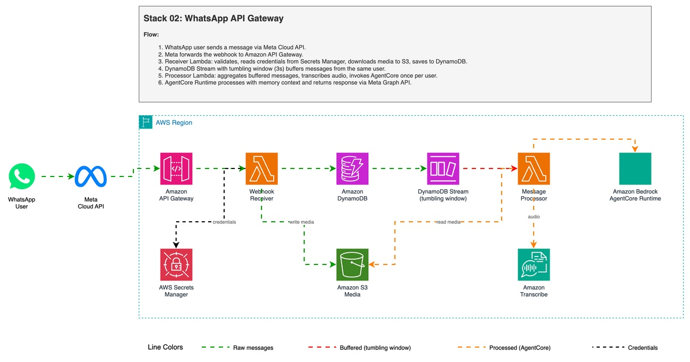

# WhatsApp Multimodal AI Agent with Meta Cloud API, Amazon API Gateway and Amazon Bedrock AgentCore

Process text, images, video, audio, and documents from WhatsApp using the [Meta WhatsApp Cloud API](https://developers.facebook.com/docs/whatsapp/cloud-api) directly with [Amazon API Gateway](https://aws.amazon.com/api-gateway/?trk=87c4c426-cddf-4799-a299-273337552ad8&sc_channel=el), a 6-function [AWS Lambda](https://aws.amazon.com/lambda/?trk=87c4c426-cddf-4799-a299-273337552ad8&sc_channel=el) pipeline, and [Amazon Bedrock AgentCore Runtime](https://aws.amazon.com/bedrock/agentcore/?trk=87c4c426-cddf-4799-a299-273337552ad8&sc_channel=el) with [Amazon Bedrock AgentCore Memory](https://docs.aws.amazon.com/bedrock-agentcore/latest/devguide/memory.html?trk=87c4c426-cddf-4799-a299-273337552ad8&sc_channel=el) for persistent conversation context.

This is the more advanced integration pattern — decoupled processing with separate functions for ingestion, routing, transcription, agent invocation, and reply delivery.

> Your data will be securely stored in your AWS account and will not be shared or used for model training. It is not recommended to share private information because the security of data with WhatsApp is not guaranteed.

| Voice notes | Image |
|----------|------------|
||  |

| Video | Document |
|--------------|--------------|
|||

✅ **AWS Level**: Advanced - 300

**Prerequisites:**

- [AWS Account](https://aws.amazon.com/resources/create-account/?trk=87c4c426-cddf-4799-a299-273337552ad8&sc_channel=el)
- [Foundational knowledge of Python](https://catalog.us-east-1.prod.workshops.aws/workshops/3d705026-9edc-40e8-b353-bdabb116c89c/?trk=87c4c426-cddf-4799-a299-273337552ad8&sc_channel=el)
- [AWS CLI configured](https://docs.aws.amazon.com/cli/v1/userguide/cli-chap-configure.html?trk=87c4c426-cddf-4799-a299-273337552ad8&sc_channel=el) with appropriate permissions
- [Python 3.12](https://www.python.org/downloads/) or later
- [AWS Cloud Development Kit (CDK)](https://docs.aws.amazon.com/cdk/v2/guide/getting_started.html?trk=87c4c426-cddf-4799-a299-273337552ad8&sc_channel=el) v2 or later
- [Meta Developer account](https://developers.facebook.com/) with WhatsApp Business API access
- Stack `00-agent-agentcore` deployed (provides SSM parameters)
- [TwelveLabs Pegasus](https://aws.amazon.com/marketplace/pp/prodview-mf4e5dbnkqvck?trk=87c4c426-cddf-4799-a299-273337552ad8&sc_channel=el) model enabled in [Amazon Bedrock](https://aws.amazon.com/bedrock/?trk=87c4c426-cddf-4799-a299-273337552ad8&sc_channel=el) console for video analysis

## How The App Works



### Infrastructure

The project uses [AWS Cloud Development Kit (AWS CDK)](https://aws.amazon.com/cdk/?trk=87c4c426-cddf-4799-a299-273337552ad8&sc_channel=el) to define and deploy the following resources:

- [AWS Lambda](https://docs.aws.amazon.com/lambda/latest/dg/welcome.html?trk=87c4c426-cddf-4799-a299-273337552ad8&sc_channel=el):
  - `whatsapp_in`: Webhook receiver — validates and stores messages in Amazon DynamoDB.
  - `process_stream`: [Amazon DynamoDB Streams](https://docs.aws.amazon.com/amazondynamodb/latest/developerguide/Streams.html?trk=87c4c426-cddf-4799-a299-273337552ad8&sc_channel=el) consumer — routes by message type.
  - `agent_processor`: Invokes Amazon Bedrock AgentCore Runtime with text/multimodal payloads.
  - `audio_transcriptor`: Starts [Amazon Transcribe](https://aws.amazon.com/transcribe/?trk=87c4c426-cddf-4799-a299-273337552ad8&sc_channel=el) jobs on audio messages.
  - `transcriber_done`: Triggered by Amazon S3 event when transcription completes.
  - `whatsapp_out`: Sends replies back via Meta Graph API.

- [Amazon Simple Storage Service (Amazon S3)](https://aws.amazon.com/s3/?trk=87c4c426-cddf-4799-a299-273337552ad8&sc_channel=el):
  - Bucket for storing media files and transcription outputs.

- [Amazon DynamoDB](https://aws.amazon.com/dynamodb/?trk=87c4c426-cddf-4799-a299-273337552ad8&sc_channel=el):
  - Message store with DynamoDB Streams enabled for event-driven processing.

- [Amazon API Gateway](https://aws.amazon.com/api-gateway/?trk=87c4c426-cddf-4799-a299-273337552ad8&sc_channel=el):
  - REST API with `/webhook` endpoint (POST for messages, GET for verification).

- [AWS Secrets Manager](https://aws.amazon.com/secrets-manager/?trk=87c4c426-cddf-4799-a299-273337552ad8&sc_channel=el):
  - Stores WhatsApp credentials (verification token, phone ID, Meta API token).

- [Amazon Bedrock AgentCore](https://aws.amazon.com/bedrock/agentcore/?trk=87c4c426-cddf-4799-a299-273337552ad8&sc_channel=el):
  - Runtime invocation for processing all message types with multimodal Strands agent.
  - Memory for persistent conversation context (short-term + long-term).

- [Amazon Transcribe](https://aws.amazon.com/transcribe/?trk=87c4c426-cddf-4799-a299-273337552ad8&sc_channel=el):
  - Used for transcribing audio/voice messages.

### Data Flow

#### 1 - Message Input

1. User sends a WhatsApp message.
2. [Meta WhatsApp Cloud API](https://developers.facebook.com/docs/whatsapp/cloud-api) forwards the message to [Amazon API Gateway](https://aws.amazon.com/api-gateway/?trk=87c4c426-cddf-4799-a299-273337552ad8&sc_channel=el) webhook (previously authenticated).
3. The `whatsapp_in` AWS Lambda function validates and stores the message in [Amazon DynamoDB](https://aws.amazon.com/dynamodb/?trk=87c4c426-cddf-4799-a299-273337552ad8&sc_channel=el).
4. The [Amazon DynamoDB Stream](https://docs.aws.amazon.com/amazondynamodb/latest/developerguide/Streams.html?trk=87c4c426-cddf-4799-a299-273337552ad8&sc_channel=el) triggers the `process_stream` AWS Lambda function.

#### 2 - Message Processing

**Text Message:**
`process_stream` sends the text directly to the `agent_processor` AWS Lambda function, which invokes [Amazon Bedrock AgentCore Runtime](https://aws.amazon.com/bedrock/agentcore/?trk=87c4c426-cddf-4799-a299-273337552ad8&sc_channel=el).

**Image/Document Message:**
`process_stream` downloads the media from Meta Graph API, uploads to [Amazon S3](https://aws.amazon.com/s3/?trk=87c4c426-cddf-4799-a299-273337552ad8&sc_channel=el), base64-encodes it, and sends as inline content block to `agent_processor`.

**Video Message:**
`process_stream` downloads the video to Amazon S3 and sends the S3 URI to `agent_processor`. The agent uses the `video_analysis` tool ([TwelveLabs Pegasus](https://aws.amazon.com/marketplace/pp/prodview-mf4e5dbnkqvck?trk=87c4c426-cddf-4799-a299-273337552ad8&sc_channel=el) via [Amazon Bedrock](https://aws.amazon.com/bedrock/?trk=87c4c426-cddf-4799-a299-273337552ad8&sc_channel=el)).

**Voice/Audio Message:**
1. `audio_transcriptor` downloads the audio to Amazon S3 and starts an [Amazon Transcribe](https://aws.amazon.com/transcribe/?trk=87c4c426-cddf-4799-a299-273337552ad8&sc_channel=el) job.
2. When the transcription completes, an Amazon S3 event triggers `transcriber_done`.
3. `transcriber_done` reads the transcript and sends it as text to `agent_processor`.

#### 3 - Agent Processing

1. `agent_processor` invokes Amazon Bedrock AgentCore Runtime with the message payload.
2. [Amazon Bedrock AgentCore Memory](https://docs.aws.amazon.com/bedrock-agentcore/latest/devguide/memory.html?trk=87c4c426-cddf-4799-a299-273337552ad8&sc_channel=el) provides conversation context (short-term turns + long-term facts).
3. The response is sent to `whatsapp_out` which delivers it via Meta Graph API.

### For pricing details, see:

- [Amazon Bedrock Pricing](https://aws.amazon.com/bedrock/pricing/?trk=87c4c426-cddf-4799-a299-273337552ad8&sc_channel=el)
- [AWS Lambda Pricing](https://aws.amazon.com/lambda/pricing/?trk=87c4c426-cddf-4799-a299-273337552ad8&sc_channel=el)
- [Amazon Transcribe Pricing](https://aws.amazon.com/transcribe/pricing/?trk=87c4c426-cddf-4799-a299-273337552ad8&sc_channel=el)
- [Amazon S3 Pricing](https://aws.amazon.com/s3/pricing/?trk=87c4c426-cddf-4799-a299-273337552ad8&sc_channel=el)
- [Amazon DynamoDB Pricing](https://aws.amazon.com/dynamodb/pricing/?trk=87c4c426-cddf-4799-a299-273337552ad8&sc_channel=el)
- [Amazon API Gateway Pricing](https://aws.amazon.com/api-gateway/pricing/?trk=87c4c426-cddf-4799-a299-273337552ad8&sc_channel=el)
- [WhatsApp pricing](https://developers.facebook.com/docs/whatsapp/pricing/)

### Key Files

- `app.py`: Entry point for the CDK application.
- `lambdas/project_lambdas.py`: CDK construct defining all 6 Lambdas + permissions.
- `lambdas/code/whatsapp_in/lambda_function.py`: Webhook handler (POST: store message, GET: verify token).
- `lambdas/code/process_stream/lambda_function.py`: Stream consumer — routes text/image/video/audio/document.
- `lambdas/code/agent_processor/lambda_function.py`: Builds multimodal payloads and invokes Amazon Bedrock AgentCore Runtime.
- `lambdas/code/audio_transcriptor/lambda_function.py`: Starts Amazon Transcribe jobs.
- `lambdas/code/transcriber_done/lambda_function.py`: Reads transcript, invokes agent_processor.
- `lambdas/code/whatsapp_out/lambda_function.py`: Sends replies via Meta Graph API.
- `layers/common/python/utils.py`: Webhook validation, response builders, phone normalization.
- `layers/common/python/media_utils.py`: Media download (Graph API), Amazon S3 upload, base64 encoding.
- `apis/webhooks.py`: Amazon API Gateway REST API construct.
- `get_param.py`: Reads AgentCore ARN from [AWS Systems Manager Parameter Store](https://docs.aws.amazon.com/systems-manager/latest/userguide/systems-manager-parameter-store.html?trk=87c4c426-cddf-4799-a299-273337552ad8&sc_channel=el) at synthesis time.

## Usage Instructions

### Installation

✅ **Clone the repository**:
```
git clone https://github.com/aws-samples/whatsapp-ai-agent-sample-for-aws-agentcore
cd 02-whatsapp-api-gateway
```

✅ **Create and activate a virtual environment**:
```
python3 -m venv .venv
source .venv/bin/activate
```

✅ **Install dependencies**:
```
uv pip install -r requirements.txt
```

✅ **Synthesize the CloudFormation template**:
```
cdk synth
```

✅ **Deploy**:
```
cdk deploy
```

> Note the output values, especially the Amazon API Gateway URL, which will be used for configuring the WhatsApp webhook.

## Configuration

### Step 0: Activate WhatsApp account Facebook Developers

1. [Get Started with the New WhatsApp Business Platform](https://www.youtube.com/watch?v=CEt_KMMv3V8&list=PLX_K_BlBdZKi4GOFmJ9_67og7pMzm2vXH&index=2&t=17s&pp=gAQBiAQB)
2. [How To Generate a Permanent Access Token — WhatsApp API](https://www.youtube.com/watch?v=LmoiCMJJ6S4&list=PLX_K_BlBdZKi4GOFmJ9_67og7pMzm2vXH&index=1&t=158s&pp=gAQBiAQB)

### Step 1: Deploy Stack 00 (AgentCore) first

This stack depends on the Amazon Bedrock AgentCore Runtime deployed in `00-agent-agentcore`. Make sure it is deployed and the SSM parameter is available:

- `/agentcore/agent_runtime_arn`

### Step 2: Set WhatsApp credentials

Edit WhatsApp configuration values in [AWS Secrets Manager](https://aws.amazon.com/secrets-manager/?trk=87c4c426-cddf-4799-a299-273337552ad8&sc_channel=el) [console](https://console.aws.amazon.com/secretsmanager/?trk=87c4c426-cddf-4799-a299-273337552ad8&sc_channel=el):

- `WHATS_VERIFICATION_TOKEN` — webhook verification token (any value, must match Step 3)
- `WHATS_PHONE_ID` — WhatsApp phone number ID from Meta Developer Console
- `WHATS_TOKEN` — Meta Graph API access token


### Step 3: Webhook Configuration

1. Go to [Amazon API Gateway Console](https://console.aws.amazon.com/apigateway?trk=87c4c426-cddf-4799-a299-273337552ad8&sc_channel=el).
2. Find the API created by the stack.
3. Go to **Stages** -> **prod** -> **/webhook** -> **GET**, and copy the **Invoke URL**.
4. Configure Webhook in the Meta Developer application:
   - Set **Callback URL** to the Invoke URL.
   - Set **Verify token** to the same value as `WHATS_VERIFICATION_TOKEN`.


### Step 4: Test

1. Send a WhatsApp message to the configured phone number.
2. Text messages are processed directly by the Amazon Bedrock AgentCore Runtime.
3. Audio messages are transcribed using Amazon Transcribe, then sent to the agent.
4. Images, videos, and documents are downloaded to Amazon S3 and processed by the agent.
5. The response is sent back to the user via WhatsApp.

## Clean up

If you finish testing and want to clean the application:

1. Delete the files from the Amazon S3 bucket created in the deployment.
2. Run this command in your terminal:

```
cdk destroy
```

## Some links for more information

- [Amazon Bedrock AgentCore documentation](https://docs.aws.amazon.com/bedrock-agentcore/latest/devguide/?trk=87c4c426-cddf-4799-a299-273337552ad8&sc_channel=el)
- [Amazon Bedrock AgentCore Runtime Sessions](https://docs.aws.amazon.com/bedrock-agentcore/latest/devguide/runtime-sessions.html?trk=87c4c426-cddf-4799-a299-273337552ad8&sc_channel=el)
- [Amazon Bedrock AgentCore Memory](https://docs.aws.amazon.com/bedrock-agentcore/latest/devguide/memory.html?trk=87c4c426-cddf-4799-a299-273337552ad8&sc_channel=el)
- [Meta WhatsApp Cloud API documentation](https://developers.facebook.com/docs/whatsapp/cloud-api)
