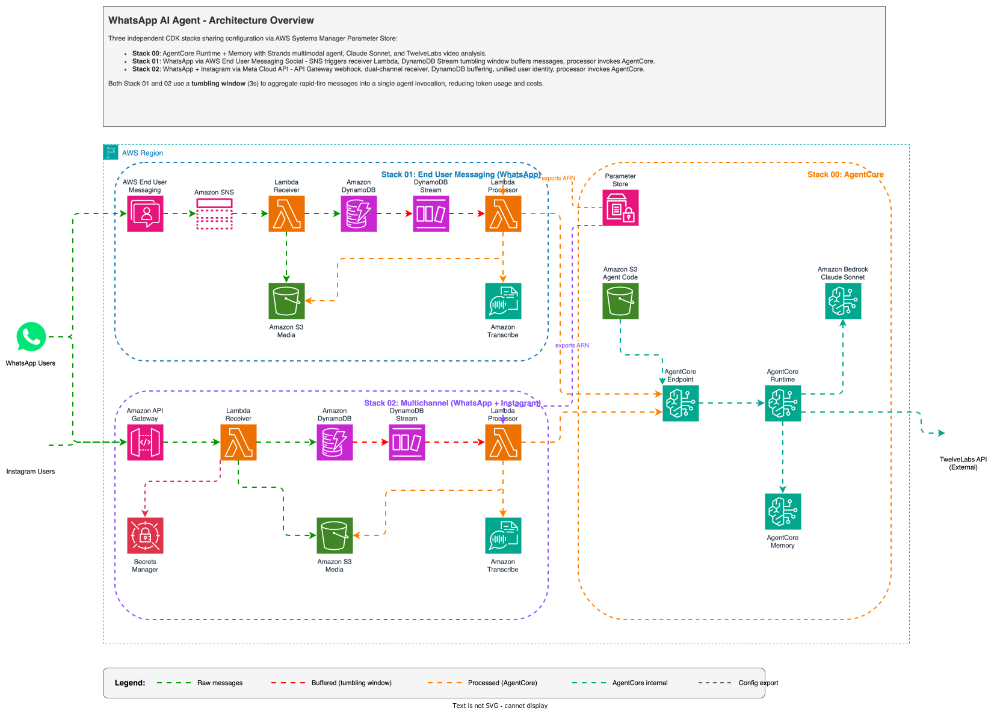

# WhatsApp AI Agent Sample for Amazon Bedrock AgentCore

A multichannel multimodal AI agent deployed on [Amazon Bedrock AgentCore Runtime](https://aws.amazon.com/bedrock/agentcore/?trk=87c4c426-cddf-4799-a299-273337552ad8&sc_channel=el) with [Amazon Bedrock AgentCore Memory](https://docs.aws.amazon.com/bedrock-agentcore/latest/devguide/memory.html?trk=87c4c426-cddf-4799-a299-273337552ad8&sc_channel=el), demonstrated through two WhatsApp integration patterns. The agent processes text, images, audio, video, and documents, converting all multimedia into text understanding before storing it in memory. The architecture is channel-agnostic: the same agent and memory layer can serve WhatsApp, Instagram, Messenger, web chat, or any frontend that invokes the AgentCore Runtime API (Application Programming Interface).

> **Important**: This is a **demo project** intended for learning and experimentation purposes only. It is **not designed for production use**. The goal is to illustrate architectural patterns and integration techniques that can serve as inspiration for building your own production-grade solutions. If you plan to use these patterns in a production environment, make sure to implement proper security hardening, error handling, scalability testing, and operational monitoring.

> **Complexity note**: This guide assumes familiarity with [AWS CDK (Cloud Development Kit)](https://aws.amazon.com/cdk/?trk=87c4c426-cddf-4799-a299-273337552ad8&sc_channel=el), [AWS Lambda](https://aws.amazon.com/lambda/?trk=87c4c426-cddf-4799-a299-273337552ad8&sc_channel=el), WhatsApp Business API concepts, and [Amazon Bedrock AgentCore](https://docs.aws.amazon.com/bedrock-agentcore/latest/devguide/what-is.html?trk=87c4c426-cddf-4799-a299-273337552ad8&sc_channel=el). A Quick Start is provided in the [Deployment Sequence](#how-do-i-deploy) section. For deeper details, refer to each stack's own README.

## Architecture



## Projects

| Project | Description | Stack |
|---------|-------------|-------|
| [00-agent-agentcore](./00-agent-agentcore/) | Standalone Amazon Bedrock AgentCore Runtime with multimodal [Strands Agents](https://strandsagents.com/) + AgentCore Memory. Exports configuration to SSM (Systems Manager) Parameter Store. |    |
| [01-whatsapp-end-user-messaging](./01-whatsapp-end-user-messaging/) | WhatsApp via [AWS End User Messaging Social](https://aws.amazon.com/end-user-messaging/?trk=87c4c426-cddf-4799-a299-273337552ad8&sc_channel=el) (Amazon SNS -> AWS Lambda -> AgentCore) |    |
| [02-whatsapp-api-gateway](./02-whatsapp-api-gateway/) | WhatsApp via [Meta Cloud API](https://developers.facebook.com/docs/whatsapp/cloud-api) (Amazon API Gateway -> Amazon DynamoDB Stream -> AWS Lambda pipeline -> AgentCore) |    |
| [notebook](./notebook/) | Jupyter notebook to test the deployed agent directly |  |

> Similar agent patterns can be implemented using other frameworks such as [LangGraph](https://github.com/langchain-ai/langgraph), [AutoGen](https://github.com/microsoft/autogen), or the [Amazon Bedrock Agents SDK](https://docs.aws.amazon.com/bedrock/latest/userguide/agents.html). This sample uses [Strands Agents](https://strandsagents.com/) for its lightweight tool integration model.

## Why is this multichannel by design?

The AgentCore Runtime and Memory layer is completely decoupled from WhatsApp. The same deployed agent can serve **any** frontend channel without modification.

### How cross-channel memory works

Memory in AgentCore is keyed by two identifiers:

- **`actor_id`** identifies the **user** (for example, `wa-user-{phone}`). This drives long-term memory: facts, preferences, and summaries that persist indefinitely across all sessions.
- **`session_id`** identifies the **conversation**. This drives short-term memory: conversation turns that expire after a configurable TTL (Time To Live).

The critical insight: if multiple frontends generate the **same `actor_id`** for the same person, the agent remembers everything about that person across all channels. A user who shares a product image on WhatsApp, asks a follow-up question via Instagram Direct Messages, and later opens a web chat will have a single unified memory profile — the agent recalls the image description, the follow-up answer, and all extracted facts.

### What channels can connect to this agent?

Any system capable of calling the [AgentCore Runtime `InvokeAgentRuntime` API](https://docs.aws.amazon.com/bedrock-agentcore/latest/devguide/runtime.html?trk=87c4c426-cddf-4799-a299-273337552ad8&sc_channel=el) can serve as a frontend:

| Channel | Integration path | `actor_id` strategy |
|---------|-----------------|---------------------|
| **WhatsApp** (AWS End User Messaging) | SNS -> Lambda -> AgentCore (Stack 01) | `wa-user-{phone}` |
| **WhatsApp** (Meta Cloud API) | API Gateway -> DynamoDB -> Lambda -> AgentCore (Stack 02) | `wa-user-{phone}` |
| **Instagram Direct Messages** | [Meta Webhooks](https://developers.facebook.com/docs/instagram-platform/webhooks) -> Lambda -> AgentCore | `ig-user-{instagram_scoped_id}` |
| **Facebook Messenger** | [Meta Webhooks](https://developers.facebook.com/docs/messenger-platform/webhooks) -> Lambda -> AgentCore | `fb-user-{page_scoped_id}` |
| **Custom web chat** | WebSocket or REST API -> Lambda -> AgentCore | `web-user-{authenticated_user_id}` |
| **Mobile app** | REST API -> Lambda -> AgentCore | `app-user-{authenticated_user_id}` |

To unify memory across channels for the same person, map all channels to a single canonical `actor_id` (for example, using an authenticated user ID or a CRM identifier instead of channel-specific IDs).

## How does multimedia memory work?

[Amazon Bedrock AgentCore Memory](https://docs.aws.amazon.com/bedrock-agentcore/latest/devguide/memory.html?trk=87c4c426-cddf-4799-a299-273337552ad8&sc_channel=el) only stores **text**. All multimedia is converted to text understanding before entering memory.

When a user sends multimedia:

1. **Image** — The agent analyzes the image using [Anthropic Claude's vision capabilities](https://docs.anthropic.com/en/docs/build-with-claude/vision) (inline content blocks), creates a detailed text description, and that description is stored in memory.
2. **Audio** — [Amazon Transcribe](https://aws.amazon.com/transcribe/?trk=87c4c426-cddf-4799-a299-273337552ad8&sc_channel=el) converts speech to text in the Lambda function. The transcript is then sent to the agent as a text prompt.
3. **Video** — The agent uses a `video_analysis` tool powered by [TwelveLabs](https://www.twelvelabs.io/) for rich visual and audio understanding (scenes, actions, on-screen text, spoken words). The text analysis is stored in memory with a `[VIDEO: id=X | desc="Y"]` tag for follow-up queries.
4. **Document** (PDF, DOCX, and others) — The agent reads the document via inline content blocks, summarizes the content, and stores the summary in memory.

Media files are organized in Amazon S3 by type: `images/`, `voice/`, `video/`, `documents/`.

The agent can answer follow-up questions about any previously shared multimedia using the stored text understanding, even after the original session expires.

## What media formats are supported?

| Media | Formats | Limits |
|-------|---------|--------|
| **Image** | JPEG, PNG, GIF, WebP | Max 5 MB per image. Max resolution 8000x8000 px (optimal under 1568 px on longest edge) |
| **Document** | PDF, CSV, DOC, DOCX, XLS, XLSX, HTML, TXT, MD | Max ~1.5 MB via WhatsApp. PDFs up to 600 pages |
| **Audio** | OGG, MP3, AAC, M4A, WAV, AMR | Any format WhatsApp supports. Automatically transcribed via [Amazon Transcribe](https://aws.amazon.com/transcribe/?trk=87c4c426-cddf-4799-a299-273337552ad8&sc_channel=el) |
| **Video** | MP4, MOV, MKV, WebM, FLV, MPEG, 3GP | Max 2 GB / 1 hour. Minimum ~4 seconds. Standard codec required (H.264/H.265). Analyzed via [TwelveLabs](https://www.twelvelabs.io/) |

## How does message buffering reduce costs?

WhatsApp users frequently send multiple messages in quick succession — breaking a thought into 2-5 rapid-fire messages instead of a single long one. Without buffering, each message triggers a separate AgentCore Runtime invocation, consuming tokens and incurring costs for every fragment.

This project implements a **DynamoDB Streams tumbling window** pattern (inspired by [sample-whatsapp-end-user-messaging-connect-chat](https://github.com/aws-samples/sample-whatsapp-end-user-messaging-connect-chat)) that accumulates messages from the same user within a configurable time window (default: 20 seconds) and sends them as a **single concatenated prompt** to the agent.

### How it works

1. Each incoming message is saved to Amazon DynamoDB with `from_phone` as partition key, ensuring all messages from the same user land in the same shard.
2. [DynamoDB Streams](https://docs.aws.amazon.com/amazondynamodb/latest/developerguide/Streams.html?trk=87c4c426-cddf-4799-a299-273337552ad8&sc_channel=el) captures the INSERT events.
3. The Lambda event source mapping uses a **tumbling window** (`tumbling_window` + `max_batching_window`) to hold records for 20 seconds before invoking the processor.
4. The processor groups messages by sender, concatenates text with newlines, and invokes AgentCore **once** per user.

### Cost impact

| Metric | Without buffering | With buffering (20s window) |
|--------|------------------|-----------------------------|
| AgentCore Runtime invocations | 1 per message | 1 per batch (~4:1 ratio) |
| LLM (Large Language Model) tokens consumed | Full context per fragment | Single context for all fragments |
| Estimated savings | baseline | **~75% fewer invocations** |

The 4:1 aggregation ratio and 75% savings estimate is based on real-world WhatsApp usage patterns reported by [sample-whatsapp-end-user-messaging-connect-chat](https://github.com/aws-samples/sample-whatsapp-end-user-messaging-connect-chat).

## How do AgentCore Runtime sessions work?

Each [AgentCore Runtime session](https://docs.aws.amazon.com/bedrock-agentcore/latest/devguide/runtime-sessions.html?trk=87c4c426-cddf-4799-a299-273337552ad8&sc_channel=el) runs in an isolated microVM with dedicated compute, memory, and filesystem.

| Parameter | Value |
|-----------|-------|
| **Maximum session duration** | 8 hours |
| **Idle timeout** | 15 minutes of inactivity |
| **Isolation** | Dedicated microVM per session |

Sessions progress: **Active** (processing requests) -> **Idle** (available for future calls) -> **Terminated** (microVM destroyed, memory sanitized). After redeploying agent code or updating IAM role permissions, wait for the idle timeout or start a new session to pick up changes.

## How do sessions and identity work in AgentCore Memory?

[Amazon Bedrock AgentCore Memory](https://docs.aws.amazon.com/bedrock-agentcore/latest/devguide/memory.html?trk=87c4c426-cddf-4799-a299-273337552ad8&sc_channel=el) operates on two layers:

| Layer | Scope | What it stores | Lifetime |
|-------|-------|----------------|----------|
| **Short-term** | Per session | Conversation turns (events) | Expires per configured TTL (default 3 days, minimum allowed by the API) |
| **Long-term** | Per actor (cross-session) | Extracted facts, preferences, summaries | Persists indefinitely |

Two IDs drive this separation:

| ID | Format | Identifies | Purpose |
|----|--------|-----------|---------|
| `actor_id` | `wa-user-{phone}` | The **user** | Long-term memory — facts and preferences that persist across all sessions |
| `session_id` | `wa-chat-{phone}` | The **conversation** | Short-term memory — conversation turns that expire per the TTL |

The SDK enforces that `session_id` and `actor_id` must be different strings. They serve distinct purposes: the actor is *who* the user is; the session is *which conversation* they are in.

**How it flows**:

```
Frontend generates:
  actor_id   = "wa-user-{phone}"    (padded to 33 chars)
  session_id = "wa-chat-{phone}"    (padded to 33 chars)

Calls InvokeAgentRuntime:
  runtimeSessionId = session_id     -> context.session_id in the agent
  runtimeUserId    = actor_id       -> also sent in payload for reliability

Agent configures AgentCoreMemoryConfig:
  actor_id   -> long-term memory namespaces: /users/{actor_id}/facts, /users/{actor_id}/preferences
  session_id -> short-term memory: conversation turns stored as events
```

When the user sends an image, the agent creates a detailed text description. That description enters short-term memory as a conversation event, and AgentCore automatically extracts facts into long-term memory. Even after the session events expire, the extracted facts remain — so the agent can answer questions about that image months later.

## How do I deploy?

Deploy stacks in order. Each subsequent stack reads configuration from [AWS Systems Manager Parameter Store](https://docs.aws.amazon.com/systems-manager/latest/userguide/systems-manager-parameter-store.html?trk=87c4c426-cddf-4799-a299-273337552ad8&sc_channel=el) parameters exported by Stack 00.

### Step 1: Deploy the shared AgentCore Runtime (required)

```bash
cd 00-agent-agentcore
python3 -m venv .venv && source .venv/bin/activate
uv pip install -r requirements.txt
bash create_deployment_package.sh   # builds ARM64 deployment ZIP
cdk deploy
```

After deployment, update the TwelveLabs API key in [AWS Secrets Manager](https://aws.amazon.com/secrets-manager/?trk=87c4c426-cddf-4799-a299-273337552ad8&sc_channel=el) (required for video analysis):

```bash
aws secretsmanager put-secret-value \
  --secret-id <TwelveLabsSecretArn from stack output> \
  --secret-string '{"TL_API_KEY":"your-actual-key"}'
```

You can obtain a TwelveLabs API key from the [TwelveLabs Dashboard](https://dashboard.twelvelabs.io/).

### Step 2a: Deploy WhatsApp via End User Messaging (Option A)

```bash
cd 01-whatsapp-end-user-messaging
python3 -m venv .venv && source .venv/bin/activate
uv pip install -r requirements.txt
cdk deploy
```

Requires [AWS End User Messaging Social](https://aws.amazon.com/end-user-messaging/?trk=87c4c426-cddf-4799-a299-273337552ad8&sc_channel=el) configured with a WhatsApp Business number. See the [Stack 01 README](./01-whatsapp-end-user-messaging/README.md) for setup details.

### Step 2b: Deploy WhatsApp via API Gateway (Option B)

```bash
cd 02-whatsapp-api-gateway
python3 -m venv .venv && source .venv/bin/activate
uv pip install -r requirements.txt
cdk deploy
```

Requires a [Meta Developer account](https://developers.facebook.com/) with WhatsApp Business API access. See the [Stack 02 README](./02-whatsapp-api-gateway/README.md) for webhook configuration.

### Step 3 (optional): Test with the notebook

```bash
cd notebook
jupyter notebook
```

Open the notebook and follow the instructions to invoke the agent directly, without a WhatsApp frontend.

## What are the prerequisites?

- [AWS CLI](https://aws.amazon.com/cli/?trk=87c4c426-cddf-4799-a299-273337552ad8&sc_channel=el) configured with appropriate credentials
- [AWS CDK](https://aws.amazon.com/cdk/?trk=87c4c426-cddf-4799-a299-273337552ad8&sc_channel=el) v2 installed (`npm install -g aws-cdk`)
- Python 3.11 or later
- [uv](https://docs.astral.sh/uv/) package manager for Python dependency management
- For Option A (Stack 01): [AWS End User Messaging Social](https://aws.amazon.com/end-user-messaging/?trk=87c4c426-cddf-4799-a299-273337552ad8&sc_channel=el) configured with a WhatsApp Business number
- For Option B (Stack 02): [Meta Developer account](https://developers.facebook.com/) with WhatsApp Business API access
- For video analysis: A [TwelveLabs](https://www.twelvelabs.io/) API key

## What are the known limitations?

- **Payload size limit**: The AgentCore Runtime `InvokeAgentRuntime` API has a payload size limit. Base64-encoded images over ~1.5 MB may cause **500 errors**. For large images, consider resizing or compressing before sending, or uploading to S3 and passing the URI.

- **Runtime session lifecycle**: Sessions stay alive for up to 8 hours and terminate after 15 minutes of inactivity. After redeploying agent code or IAM role changes, wait for the idle timeout or start a new session to pick up changes. See [Runtime Sessions documentation](https://docs.aws.amazon.com/bedrock-agentcore/latest/devguide/runtime-sessions.html?trk=87c4c426-cddf-4799-a299-273337552ad8&sc_channel=el).

- **Runtime initialization timeout (30 seconds)**: The deployment package must include `bedrock-agentcore-starter-toolkit` in `requirements.txt`, and `multimodal_agent.py` must end with `app.run()`. Without these, the runtime fails to start within the initialization window.

- **Content block ordering**: When sending multimodal content blocks to the agent, text must be the **first** content block. `AgentCoreMemorySessionManager` reads `content[0]["text"]` and will fail with a `KeyError` if the first block is an image or document.

- **Memory contamination is permanent**: If invalid content enters AgentCore Memory, it cannot be deleted per-record. The entire Memory resource must be recreated. All media must be validated before reaching the agent.

## Troubleshooting

| Symptom | Resolution |
|---------|------------|
| SSM parameter not found | Ensure Stack 00 (`00-agent-agentcore`) is deployed first, in the same AWS account and region. |
| AgentCore Memory errors | Verify the Memory ID is correctly set in the Runtime environment. See [AgentCore Memory documentation](https://docs.aws.amazon.com/bedrock-agentcore/latest/devguide/memory.html?trk=87c4c426-cddf-4799-a299-273337552ad8&sc_channel=el). |
| WhatsApp webhook failures | Check [Amazon CloudWatch Logs](https://aws.amazon.com/cloudwatch/?trk=87c4c426-cddf-4799-a299-273337552ad8&sc_channel=el) for the Lambda function handling webhooks. |
| Media processing timeout | Lambda timeout is set to 5 minutes. Large files may need additional time or pre-processing. |
| Video analysis S3 errors | The AgentCore runtime role needs `s3:GetObject` on the media bucket. Stack 01 grants this automatically using the runtime role ARN exported via SSM by Stack 00. |
| Agent does not pick up new code | Wait 15 minutes for the idle timeout, or use a new `session_id` to force a fresh microVM. |

For additional help, consult the [Amazon Bedrock AgentCore Developer Guide](https://docs.aws.amazon.com/bedrock-agentcore/latest/devguide/what-is.html?trk=87c4c426-cddf-4799-a299-273337552ad8&sc_channel=el).

---

## Contributing

Contributions are welcome! See [CONTRIBUTING](CONTRIBUTING.md) for more information.

---

## Security

If you discover a potential security issue in this project, notify AWS/Amazon Security via the [vulnerability reporting page](http://aws.amazon.com/security/vulnerability-reporting/). Please do **not** create a public GitHub issue.

---

## License

This library is licensed under the MIT-0 License. See the [LICENSE](LICENSE) file for details.

---

## Connect with me

🇻🇪

[](https://dev.to/elizabethfuentes12)
[](https://www.linkedin.com/in/lizfue/)
[](https://github.com/elizabethfuentes12/)
[](https://x.com/ElizabethFue12)
[](https://www.instagram.com/elifue.tech)
[](https://www.youtube.com/channel/UCr0Gnc-t30m4xyrvsQpNp2Q?sub_confirmation=1)
